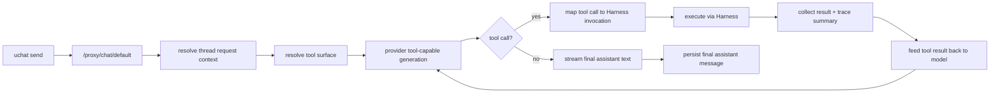

# Chat Tool Integration POC

Status: Planned
Owner: chat / runtime / mcp
Last verified: 2026-06-26
Layer: raw-source
Module: Chat
Feature: ToolIntegration
Doc Type: design

## Goal

This POC defines the smallest end-to-end path for integrating `Harness` tools into
the current normal chat flow.

It is intentionally narrow:

- normal chat only
- one or two safe tools only
- no external MCP marketplace exposure in chat
- approval can be simplified or temporarily disabled for read-only tools

## POC Success Criteria

The POC is successful if all of the following are true:

1. normal chat can expose at least one tool to the model
2. the model can request a tool call
3. backend translates the request into a `Harness` invocation
4. tool result is fed back into the model
5. final assistant answer reaches `uchat`
6. `uchat` shows a minimal execution state block
7. the tool execution is traceable through existing `Harness` trace endpoints

## Scope

### In scope

- normal chat `default` provider route
- one built-in safe tool:
  - preferred: `web_search`
  - alternate: one `read_*` capability
- backend tool loop orchestration
- `uchat` minimal tool execution rendering
- unit / route tests around orchestration

### Out of scope

- RAG chat tool loop
- approval wait UI
- external MCP tools in chat
- destructive terminal / edit tools
- role-based dynamic toolset policy
- tool selection UI in composer

## Recommended First Tool

### Preferred

`web_search`

Reason:

- safe enough for MVP
- simple input / output shape
- obvious value in chat
- does not require workspace roots

### Alternate

`read_list` or `read_open`

Reason:

- safe if workspace root is already configured
- aligns with existing `Harness` strengths

Constraint:

- avoid edit and terminal in first POC

## Target Flow

## Proposed Backend Changes

### 1. Add a chat tool surface resolver

Suggested new file:

- `server/src/routes/proxy-provider/chat-tool-surface.ts`

Responsibility:

- resolve which chat tools are visible for this request
- convert `Harness` tool definitions into provider-facing tool definitions

For POC:

- hardcode one safe tool id allowlist

### 2. Add a chat tool loop orchestrator

Suggested new file:

- `server/src/routes/proxy-provider/chat-tool-loop.ts`

Responsibility:

- call provider with tool definitions
- inspect provider response
- if tool call exists, invoke `Harness`
- normalize tool result
- continue model loop
- emit stream events

For POC:

- one tool call at a time
- max loop count = 3
- no approval branch yet for read-only tool

### 3. Add provider tool normalization contract

Suggested new file:

- `server/src/services/provider-proxy.service/tool-calls.ts`

Responsibility:

- normalize provider-specific tool call output
- normalize tool result messages back into provider input

### 4. Keep execution inside Harness

Use existing endpoints / execution path conceptually, but call runtime directly from server-side orchestration.

Relevant existing modules:

- `server/src/mcp/harness/invocations.ts`
- `server/src/mcp/core/invocations.ts`

POC rule:

- do not bypass `Harness`
- do not execute concrete tool modules directly from chat

## Proposed Frontend Changes

### 1. Extend chat run event protocol

Suggested additions in the desktop protocol mapping:

- `tool:requested`
- `tool:running`
- `tool:succeeded`
- `tool:failed`

Current likely touchpoints:

- `desktop/src/features/chat/core/protocol.ts`
- `desktop/src/shared/uchat/core/types.ts`
- `desktop/src/shared/uchat/core/runtime.ts`

### 2. Add minimal `uchat` tool execution UI

Suggested rendering:

- a compact assistant-side execution block above the final answer
- show:
  - tool name
  - running / success / failed
  - one-line summary

Current likely touchpoint:

- `desktop/src/shared/uchat/ui/UChatThreadView.tsx`

POC rule:

- do not build a large tool panel yet
- do not add a second parallel tool UI system
- reuse the existing execution-trace visual language as much as possible

## Persistence Recommendation

For the POC:

- user message remains visible and persisted as today
- final assistant answer remains visible and persisted as today
- tool raw output is not persisted as a normal visible assistant message
- optional:
  - persist a compact tool trace summary in assistant metadata
  - or keep tool execution entirely trace-only in phase 1

This avoids polluting visible history before the message contract is settled.

## Testing Plan

### Backend

Add route tests covering:

1. provider returns no tool call -> normal behavior unchanged
2. provider returns one supported tool call -> harness executes -> final answer produced
3. tool execution fails -> chat receives explicit error event
4. unsupported tool id -> backend rejects or falls back safely
5. loop guard prevents infinite tool recursion

### Frontend

Add `uchat` behavior tests covering:

1. tool running state renders
2. tool success state renders
3. tool error state renders
4. final assistant answer still renders after tool execution

## Rollout Plan

### Phase POC-1

- tool surface resolver
- backend tool loop
- one tool only
- no approval
- basic `uchat` execution block

### Phase POC-2

- add approval wait state
- add detail drawer for invocation trace
- add compact persisted summary

### Phase POC-3

- scoped toolset by thread / role / route
- external MCP tool exposure
- role-level tool policy

## Open Questions

These should be answered before leaving POC phase:

1. Should tool summary become visible history or remain trace-only?
2. Should `Role` influence allowed toolset?
3. Should RAG chat get tools through the same loop or via graph nodes?
4. Should approval be unified with `Harness` invocation state only, or mirrored into thread state?

## Recommendation

Start the POC with:

- normal chat
- `web_search`
- backend `Harness` execution
- minimal `uchat` execution rendering

This gives the project a real vertical slice without prematurely solving every policy and UX edge.
