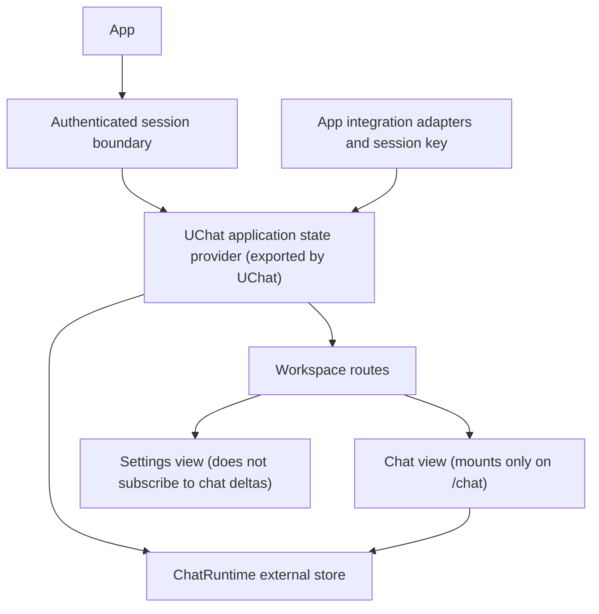

# UChat 应用级状态生命周期设计

Status: Current
Owner: chat
Last verified: 2026-07-22
Layer: design
Module: Chat
Feature: UChatApplicationState
Doc Type: implementation-record
Canonical: false
Related:
  - ../uchat.md
  - ../uchat-internal-maintenance.md
  - README.md
  - uchat-ui-slot-design.md

> 当前状态：应用级状态宿主已于 2026-07-22 实施。
>
> 本文记录当前生命周期合同和验证证据。组件插槽、消息结构、缓存淘汰和更进一步的运行语义调整仍不在本次实施范围内。

## 1. 背景与实施前现状

当前 `ChatWorkspace` 声明要在设置工作区显示时保持 UChat runtime 挂载，但实现会在 `visible === false` 时直接返回 `null`。`ChatKnowledgeBaseStateProvider` 和 `ChatRuntimeProvider` 都位于这个条件分支之后，因此切换到设置页会卸载它们。

当前路由还将 `/chat` 和 `/settings` 定义为两个并列路由记录，并分别创建 `BaseLayout` 元素。只把 Provider 从 `ChatWorkspace` 移到现有 `BaseLayout`，不能单独构成跨路由生命周期保证。

直接影响包括：

- 未发送草稿和欢迎页选项随 Provider 重建而丢失；
- 返回聊天页会重新创建 runtime，并再次执行线程列表启动加载；
- 已经启动的异步请求可能继续持有旧 runtime，但新聊天界面订阅的是另一个 runtime；
- 代码注释描述的生命周期与实际组件树不一致，增加问题定位难度。

该缺陷的替代实现和回归测试现位于：

- `desktop/src/shared/uchat/ui/react.test.tsx`
- `desktop/src/features/chat/core/runtime.provider.test.tsx`
- `desktop/src/app/ChatApplicationStateBoundary.test.tsx`

当前实现中，`ChatWorkspace` 只拥有可见聊天界面；runtime 位于共同的已登录路由祖先中。

## 2. 当前合同

在同一已登录用户会话内，使聊天运行状态独立于聊天页面是否挂载：

1. 在 `/chat`、`/settings` 之间切换时保持同一个 runtime 实例；
2. 保留当前线程、已加载消息、未发送草稿和当前运行状态；
3. 聊天页面返回后重新订阅现有状态，不创建第二份 runtime；
4. 设置页面不订阅聊天消息增量，也不因流式 delta 重渲染；
5. 用户退出或身份变化时，旧用户聊天状态不能泄漏到新会话；
6. 不以“应用级状态”为理由预加载全部线程的完整消息。
7. 应用级聊天状态宿主由 UChat 公共入口导出，应用层只负责装配，不再实现第二套聊天状态容器。

## 3. 非目标

本规划不包含：

- 修改 SSE、后端路由或消息持久化协议；
- 增加同时运行多个聊天任务的能力；
- 把图片预览、抽屉、悬浮状态等纯视图状态放入应用状态；
- 保证应用重启后恢复未发送草稿；
- 同时实施组件插槽规划；
- 在没有测量结果前确定固定的线程缓存数量；
- 改变停止、取消、审批或恢复任务的产品语义。
- 让 UChat 直接依赖应用认证、路由、知识库、角色、桌面 API 或具体后端协议。

## 4. 当前所有权边界

| 状态 | 当前所有者 | 说明 |
| --- | --- | --- |
| `ChatRuntime` 实例 | 已登录应用会话 | 同一用户会话内保持稳定 |
| 线程摘要 | runtime store | 允许应用生命周期内缓存，不代表完整消息已加载 |
| 当前线程与已加载消息 | runtime store | 继续按需加载，后端仍是持久化事实来源 |
| 编辑器文本与附件 | runtime / thread draft state | 页面切换后可恢复 |
| 当前运行状态 | runtime | 全局保持单任务，`activeRunThreadId` 标识运行线程；页面不可见或切换线程时仍可被运行驱动更新 |
| 知识库和角色草稿选择 | chat draft state | 与 runtime 生命周期一致 |
| 图片预览、详情抽屉、hover | 聊天视图组件 | 页面卸载时允许清理 |
| DOM、滚动引用、动画帧 | 聊天视图组件 | 不得进入应用状态 |

“进入应用状态”指所有权和生命周期提升，不等于让应用根组件订阅整个聊天状态，也不等于把所有线程内容放入 React Context。

### 4.1 UChat 与应用集成的职责

UChat 已导出应用级状态宿主 `UChatApplicationStateProvider`。该宿主负责：

- 按会话标识创建并持有唯一的 `ChatRuntime`；
- 导出 runtime、selector 和 canonical draft 的 React 接口；
- 在会话标识变化时隔离旧状态；
- 保持 UChat core 的 framework-neutral store 为状态事实来源；
- 为应用扩展状态提供注入接口，但不认识扩展字段的业务含义。

应用集成层只负责：

- 提供当前用户对应的稳定会话标识；
- 注入 repository、run driver、attachment driver 和 policy；
- 将知识库、角色、Agent、TTS、图片和工作空间等业务选项转换为 UChat 可消费的线程创建输入；
- 监听应用事件并调用 UChat 公共命令；
- 将 UChat 宿主放到正确的已登录路由边界。

应用层不得复制 `threads`、messages、composer、run status 或 hydrated thread 状态，也不得再创建一个与 UChat store 双向同步的 Redux、Context 或 Zustand store。

具体业务草稿字段没有为了“统一状态”直接写入 UChat core。当前由桌面集成层持有，并与 UChat 应用宿主共享同一个用户会话生命周期。若未来要形成可复用 extension state / thread context contract，需要另行设计和评审。

## 5. 当前组件边界



目标宿主由 UChat 公共入口导出，并通过 `ChatApplicationStateBoundary` 位于首页、`/chat` 与 `/settings` 的共同已登录祖先中，以当前用户 ID 作为生命周期边界。

### 5.1 当前装配形态

当前装配的职责关系如下。桌面集成组件内部使用 UChat 导出的宿主，应用路由只提供用户会话边界：

```tsx
<AppChatRuntimeProvider sessionKey={authenticatedUserId}>
  <WorkspaceRoutes />
</AppChatRuntimeProvider>
```

`AppChatRuntimeProvider` 内部只负责桌面适配和业务草稿，并使用从 `shared/uchat` 公共入口导出的 `UChatApplicationStateProvider`。`createStableAppChatRuntime` 和应用事件绑定留在 `features/chat`。依赖只能从应用集成层指向 UChat，不能反向引用。

## 6. 性能约束

### 6.1 必须满足

- runtime 使用稳定实例和外部 store；应用壳层不得订阅完整 `threads` 或活动消息数组。
- 设置页面打开时，聊天文本 delta 不得增加设置页面组件的渲染次数。
- `/chat -> /settings -> /chat` 不得仅因路由切换再次调用线程列表启动加载。
- 完整消息继续按线程按需加载；不得在宿主挂载时加载所有线程正文。
- 已完成线程缓存必须有可测量的内存边界。边界值在真实数据测量后确定，不在设计阶段猜测。
- Provider 和全局事件监听器在反复切页后只能保留一份。

### 6.2 后续性能基线

实施任务开始前记录以下基线：

- 100 个线程摘要、1 个已加载长线程时的 renderer heap；
- 设置页停留期间接收 500 个模拟 delta 时，设置页面的 React commit 次数；
- 连续切换聊天与设置 20 次后的 `loadThreads` 调用次数和事件监听器数量；
- 返回聊天页时恢复草稿与活动线程所需的渲染提交次数。

基线脚本和临时数据必须放在仓库根目录 `.test-artifact/`，不得提交业务数据。

## 7. 任务运行语义风险

当前页面隐藏后的任务语义是：

- 同一用户进入设置页：任务继续，runtime 继续接收事件；
- 返回聊天页：展示同一任务的最新状态；
- 运行中切换到其他线程：后台任务继续；新线程输入框可编辑并保留草稿，但发送保持禁用，也不能取消不属于当前线程的任务；
- 退出登录或用户身份变化：卸载旧会话宿主并调用 `cancelSend()`，不得继续把结果写入新用户状态；
- 应用关闭：沿用现有关闭行为，不在本规划中新增后台运行能力。

实现没有添加旧 runtime 转发、双 runtime 同步或静默 fallback。

## 8. 实施记录

### 阶段 A：证据与合同（已完成）

- 记录实施前卸载缺陷；
- 审核认证边界、路由边界和用户身份来源；
- 不修改生产代码。

### 阶段 B：只移动所有权（已完成）

- 由 UChat 公共入口导出应用级 state provider 和 selector 接口；
- 在已登录应用会话边界装配该 provider，并注入桌面端 runtime 工厂与扩展；
- 保持现有 runtime、store、draft 数据结构和并发语义；
- 聊天视图仍可在设置页卸载；
- 不同时引入缓存淘汰、插槽或消息结构调整。

### 阶段 C：验证和有限缓存（部分完成）

- 已完成切页、草稿、运行时身份、监听器、按需 hydration 和用户切换测试；
- 已用非订阅组件 render counter 验证聊天 store 更新不会重渲染设置表面；
- 尚未采集真实 renderer heap 和 React Profiler 长时间基线；
- 没有引入新的线程缓存或淘汰策略。

后续缓存、后台运行或任务恢复语义仍需作为独立任务批准。

## 9. 验收测试矩阵

| 场景 | 预期 | 类型 |
| --- | --- | --- |
| 聊天切到设置 | runtime Provider 不卸载 | 生命周期测试 |
| 设置返回聊天 | runtime 对象身份不变 | 生命周期测试 |
| 带文本和附件草稿切页 | 草稿完整恢复 | 交互测试 |
| 流式任务中进入设置 | 同一 runtime 继续接收事件 | 运行测试，需先批准任务语义 |
| 设置页接收聊天 delta | 设置页面不重渲染 | React Profiler / render counter |
| 连续切页 20 次 | 无重复监听器、无重复启动加载 | 集成测试 |
| 退出并切换用户 | 旧线程、草稿和运行结果不可见 | 会话隔离测试 |
| 100 个线程摘要启动 | 不加载全部线程正文 | adapter 调用断言 |
| 返回已加载线程 | 不重复请求已存在消息 | 缓存合同测试 |
| 模型或知识库设置变化 | runtime 身份不变，能力配置刷新 | 集成测试 |
| UChat 公共入口检查 | 应用级状态宿主由 UChat 导出 | 模块边界测试 |
| UChat 依赖检查 | UChat 不导入 `app`、`features` 或桌面 API | 静态边界测试 |

## 10. 当前测试证据

当前自动化证据分为三层：

- `shared/uchat/ui/react.test.tsx`：UChat 公共导出、同会话 runtime 身份、用户切换清理和 selector 隔离；
- `features/chat/core/runtime.provider.test.tsx`：草稿保留、用户隔离、一次启动加载、按需 hydration 和监听器不重复；
- `app/ChatApplicationStateBoundary.test.tsx`：生产路由层级和聊天/设置切换时宿主不卸载。

相关测试当前均为真实断言，没有以 `todo` 代替已实施合同。

## 11. 本次确定的决策

1. 进入设置页后，普通聊天与 Agent 任务继续使用同一 runtime；
2. 登出或用户变化时调用旧 runtime 的 `cancelSend()`；
3. 当前欢迎页草稿继续只保存一份，不新增按工作空间分片；
4. 本次不增加消息缓存淘汰策略，真实 heap 基线仍待后续测量；
5. 本次不把滚动位置等视图状态提升到应用状态。

## 12. 当前技术选型结论

当前实现复用 UChat 已有的 `zustand/vanilla` store，不引入 Redux。

原因不是减少依赖本身，而是状态事实已经位于 UChat core。为应用级生命周期再引入 Redux，会形成两个聊天状态来源并迫使应用层承担同步职责，与本设计要求的 UChat 自主管理相冲突。
