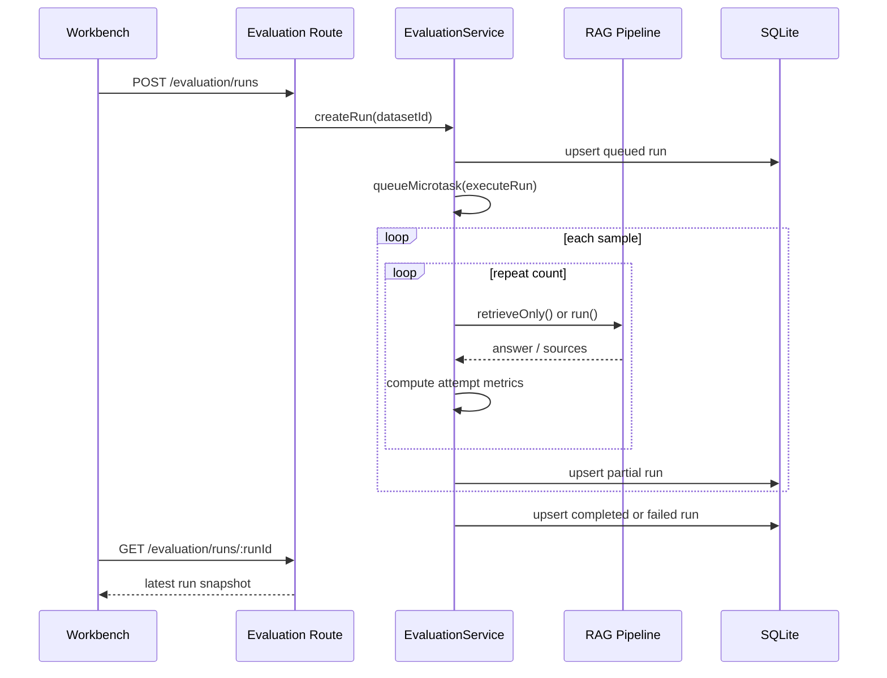

# Evaluation Workbench / Evaluation Center

评测工作台与评测中心技术文档，覆盖当前实现、页面职责、调用链路、接口契约、持久化结构、联调结论与已知限制。

## 概览

当前评测能力已经形成两条相互配合的主链路：

1. 评测工作台 `Workbench`
   负责生成评测包、上传评测包、预检数据集、创建评测任务、查看运行中日志和本次结果快照。
2. 评测中心 `Center`
   负责读取历史 run、搜索记录、查看详情抽屉、导出 Markdown 报告、删除已完成或失败记录。

这套能力面向桌面端本地 RAG 调试，采用“单进程执行 + SQLite 持久化”的实现模型，不依赖独立任务队列服务。

## 当前目标

当前版本的目标不是做完整评测平台，而是先把“本地可用、可复盘、可持续迭代”的主链路跑通：

- 支持从默认知识库自动生成评测包
- 支持上传真实评测包 zip 并解析
- 支持创建真实评测任务并异步执行
- 支持样本级重复执行、并发执行和超时控制
- 支持运行中轮询、日志回显和结果汇总
- 支持评测结果持久化、历史读取、详情查看和 Markdown 导出

## 当前能力

### 工作台

- 评测包生成器
- 评测包上传与解析
- 数据集结构校验与预览
- 创建评测任务
- 轮询单个 run 状态
- 展示运行日志
- 展示本次运行汇总指标
- 展示当前运行的样本结果和校验结果

### 评测中心

- 读取历史 run 列表
- 关键字搜索 run 名称 / 数据集名称
- 手动刷新列表
- 打开详情抽屉查看完整诊断
- 导出 Markdown 报告
- 删除已完成 / 已失败 run

### 当前指标

- 检索类：`hitAtK`、`recallAtK`、`mrr`、`sourceHitRate`
- 生成类：`faithfulness`、`answerRelevance`、`answerCompleteness`
- 运行类：`averageLatencyMs`、`failedCount`

## 页面结构

### 评测工作台

前端实现位于：

- [Workbench.tsx](/D:/workspace/rag-demo/desktop/src/features/Settings/pages/Evaluation/Workbench.tsx)
- [EvaluationPackageGeneratorModal.tsx](/D:/workspace/rag-demo/desktop/src/features/Settings/components/Evaluation/EvaluationPackageGeneratorModal.tsx)

主要分为 4 块：

1. 顶部动作区
   - `生成评测包`
   - `开始评测`
2. 状态条 `WorkbenchStateBar`
   - 当前任务状态
   - 当前数据集
   - 样本进度
   - 运行模式
   - `topK / topN`
3. 左侧数据集与校验区
   - 上传 zip
   - 查看包摘要、配置、预览入口
   - 查看 validation 列表
4. 右侧控制台与结果区
   - 运行日志
   - 本次 run 汇总结果
   - 样本状态摘要

### 评测中心

前端实现位于：

- [Center.tsx](/D:/workspace/rag-demo/desktop/src/features/Settings/pages/Evaluation/Center.tsx)
- [DetailDrawer.tsx](/D:/workspace/rag-demo/desktop/src/features/Settings/components/Evaluation/DetailDrawer.tsx)
- [exportMarkdown.ts](/D:/workspace/rag-demo/desktop/src/features/Settings/pages/Evaluation/exportMarkdown.ts)

主要分为 3 块：

1. 顶部工具区
   - 记录数展示
   - 搜索框
   - 刷新按钮
2. 列表区
   - run 名称 / 数据集
   - 状态
   - 样本数
   - 关键指标摘要
   - 完成时间
   - 查看 / 下载 / 删除动作
3. 详情抽屉
   - 指标总览
   - 运行配置
   - 数据集摘要
   - validation 列表
   - 样本级结果
   - attempt 级细节
   - run logs

## 评测包协议

### 上传解析使用的 zip 结构

后端解析入口：`POST /evaluation/datasets/parse`

当前约定至少包含：

- `evalset.json`
- `documents/`

可选：

- `manifest.json`

说明：

- `manifest.json` 缺失时，系统不会直接拒绝；会使用文件名与默认配置回填，但 validation 会给出提示
- `documents/` 主要用于预览和结构完整性校验；当前并不会在评测执行时直接从 zip 中加载原文内容

### `manifest.json`

当前文档中真正会被消费的字段：

- `datasetName`
- `knowledgeBaseId`
- `config.mode`
- `config.topK`
- `config.topN`
- `config.repeat`
- `config.concurrency`
- `config.timeoutSeconds`

其中：

- `mode` 仅支持 `retrieve` / `retrieve-generate`
- `knowledgeBaseId` 会在执行阶段传给 RAG pipeline

### `evalset.json`

支持两种结构：

- 直接是样本数组
- `{ samples: [...] }`

单条样本当前会读取这些字段：

- `id`
- `question`
- `expectedAnswer`
- `referenceAnswer`
- `goldSources`
- `tags`

其中：

- `expectedAnswer` 优先使用
- 如果没有 `expectedAnswer`，会回退到 `referenceAnswer`
- 没有有效 `question` 的样本会被过滤掉

## 评测包生成器

后端入口：`POST /evaluation/packages/generate`

相关实现：

- [evaluation-package-generator.service.ts](/D:/workspace/rag-demo/server/src/services/evaluation-package-generator.service.ts)

当前策略：

- 从默认知识库中选择 `enabled + ready` 的文档
- 随机抽取文档，再随机抽取 chunk
- 调用 `providerProxyService.generateTextForRole("evaluation")` 生成问答样本
- 组装 `manifest.json`、`evalset.json` 和 `documents/` 占位文件
- 以 zip 形式返回给前端下载

输入参数包括：

- `datasetName`
- `sampleCount`
- `documentCount`
- `chunksPerDocument`
- `mode`
- `topK`
- `topN`
- `repeat`
- `concurrency`
- `timeoutSeconds`

当前约束：

- `concurrency` 会被限制在 `1~10`
- `timeoutSeconds` 会被限制在 `5~300`
- 如果评测模型生成失败，会回退到基于 chunk 内容的 fallback 问题与参考答案

## 校验与预览

数据集解析后，前端会得到 `EvaluationDatasetRecord`，其中包含：

- `summary`
- `config`
- `documents`
- `previewSamples`
- `validations`

当前 validation 维度固定为 3 类：

- `structure`：包结构是否完整
- `reference`：参考答案覆盖情况
- `sources`：`goldSources` 覆盖情况

状态值：

- `pass`
- `warning`
- `error`

工作台只有在以下条件同时满足时才允许启动评测：

- 已成功解析数据集
- 当前没有在解析
- 当前没有进行中的 run
- 所有 validation 中不存在 `error`

## 执行模型

后端核心实现位于：

- [evaluation.service.ts](/D:/workspace/rag-demo/server/src/services/evaluation.service.ts)

### 创建 run

入口：`POST /evaluation/runs`

创建流程：

1. 根据 `datasetId` 读取已解析数据集
2. 若数据集不存在，返回 `404`
3. 若 validation 含 `error`，返回 `400`
4. 若没有可运行样本，返回 `400`
5. 生成 `queued` 状态的 `EvaluationRunRecord`
6. 先写入内存与 SQLite
7. 通过 `queueMicrotask()` 异步启动 `executeRun()`

这意味着：

- 接口返回很快
- 前端需要轮询获取后续状态

### run 状态

后端 run 状态仅有：

- `queued`
- `running`
- `completed`
- `failed`

前端工作台额外有两个本地状态：

- `idle`
- `ready`

### 并发执行

`executeRun()` 会根据数据集配置读取：

- `repeat`
- `concurrency`
- `timeoutSeconds`

执行模型是“样本级 worker 并发”：

- `workerCount = min(concurrency, sampleCount)`
- 每个 worker 从共享索引中取样本
- 每个样本完成后立刻增量写回 run

这套模型的特点：

- 实现简单，适合桌面端本地执行
- 能较快看到进度和部分结果
- 不具备跨进程恢复和分布式调度能力

### 单样本执行

`evaluateSample()` 会按 `repeatCount` 逐次执行同一条样本。

每次 attempt：

1. 记录开始日志
2. 按 `mode` 调用 RAG pipeline
3. 应用单样本超时控制
4. 计算本次 attempt 的检索与生成指标
5. 记录 attempt 级结果

最后会聚合为 1 条样本结果 `EvaluationSampleResult`，同时保留 `attempts` 明细。

## RAG 调用模式

### `retrieve`

- 调用 `ragPipeline.retrieveOnly()`
- 只返回检索来源
- `answerText` 为空
- 生成类指标理论上无意义，但字段仍保持存在，默认趋近于 0

### `retrieve-generate`

- 调用 `ragPipeline.run()`
- 返回 `answer + sources`
- 同时计算检索类与生成类指标

RAG 调用入口：

- [rag-pipeline.ts](/D:/workspace/rag-demo/server/src/services/rag-pipeline.ts)

## 指标实现

### 检索类

- `hitAtK`
  含义：是否命中任一 gold source
- `recallAtK`
  含义：命中的 gold source 占全部 gold source 的比例
- `mrr`
  含义：首个正确来源排名的倒数均值
- `sourceHitRate`
  含义：返回来源是否与 gold source 有重合

### 生成类

- `faithfulness`
  含义：答案与检索来源内容的词项重合度
- `answerRelevance`
  含义：答案与问题 / 参考答案的词项相关性
- `answerCompleteness`
  含义：答案对参考答案关键 token 的覆盖率

### 运行类

- `averageLatencyMs`
- `failedCount`

说明：

- 当前生成类指标是启发式打分，不是 LLM judge
- 更适合作为工程调试信号，而不是最终学术或业务评测标准

## 持久化模型

数据库实现位于：

- [evaluation.db.ts](/D:/workspace/rag-demo/server/src/db/evaluation.db.ts)

当前使用两张表：

- `evaluation_datasets`
- `evaluation_runs`

特点：

- 结构化字段只保留基础索引列
- 完整对象主要以 JSON 快照形式存入 `dataset_json` / `run_json`
- 数据读取时会做兼容归一化，避免旧 run 因字段缺失导致前端报错

### `evaluation_datasets`

主要字段：

- `id`
- `knowledge_base_id`
- `dataset_name`
- `file_name`
- `file_size`
- `uploaded_at`
- `dataset_json`
- `samples_json`

### `evaluation_runs`

主要字段：

- `id`
- `dataset_id`
- `name`
- `status`
- `started_at`
- `completed_at`
- `run_json`

当前索引：

- `idx_evaluation_datasets_uploaded_at`
- `idx_evaluation_runs_dataset_id`
- `idx_evaluation_runs_started_at`
- `idx_evaluation_runs_status`

## API 列表

路由实现位于：

- [server/src/routes/evaluation/index.ts](/D:/workspace/rag-demo/server/src/routes/evaluation/index.ts)
- [server/src/routes/evaluation/schemas.ts](/D:/workspace/rag-demo/server/src/routes/evaluation/schemas.ts)

前端请求封装位于：

- [desktop/src/shared/api/evaluation.ts](/D:/workspace/rag-demo/desktop/src/shared/api/evaluation.ts)

### `POST /evaluation/packages/generate`

用途：

- 生成评测包 zip

返回：

- `application/zip`
- `Content-Disposition` 中包含下载文件名

### `POST /evaluation/datasets/parse`

用途：

- 上传并解析评测包

输入：

- `multipart/form-data`
- 单个 zip 文件

返回：

- `EvaluationDatasetRecord`

### `POST /evaluation/runs`

用途：

- 创建评测任务

输入：

- `datasetId`
- `name?`

返回：

- `EvaluationRunRecord`

### `GET /evaluation/runs`

用途：

- 读取 run 列表

当前支持 query：

- `status?`

备注：

- 前端评测中心当前没有暴露状态筛选 UI，但后端能力已经具备

### `GET /evaluation/runs/:runId`

用途：

- 读取单个 run 最新快照

用于：

- 工作台轮询进行中 run
- 评测中心详情查看

### `DELETE /evaluation/runs/:runId`

用途：

- 删除指定 run

限制：

- `queued` / `running` run 不允许删除

返回：

- `{ id, deleted }`

## 前端轮询与状态更新

### 工作台

工作台在 run 处于以下状态时持续轮询：

- `queued`
- `running`

轮询周期：

- `1500ms`

状态更新逻辑：

- 若请求成功，则覆盖当前 `runRecord`
- 若请求失败，则保留最后可见状态，下一轮继续尝试

### 评测中心

评测中心当前不做自动轮询，而是：

- 首次进入时加载一次
- 点击刷新时重新请求
- 删除成功后本地移除记录
- 如果当前详情抽屉打开，会在刷新后尝试用新列表中的同 id run 替换旧对象

## 导出能力

Markdown 导出实现位于：

- [exportMarkdown.ts](/D:/workspace/rag-demo/desktop/src/features/Settings/pages/Evaluation/exportMarkdown.ts)

当前导出内容包含：

- run 基本信息
- 数据集信息
- 运行参数说明
- 指标说明与汇总
- validation 列表
- 样本级概览
- attempt 级细节
- 日志信息

导出的定位不是“原始数据 dump”，而是更适合阅读、汇报和归档的文本报告。

## 关键代码位置

### 前端

- [desktop/src/shared/api/evaluation.ts](/D:/workspace/rag-demo/desktop/src/shared/api/evaluation.ts)
- [desktop/src/features/Settings/pages/Evaluation/Workbench.tsx](/D:/workspace/rag-demo/desktop/src/features/Settings/pages/Evaluation/Workbench.tsx)
- [desktop/src/features/Settings/pages/Evaluation/Center.tsx](/D:/workspace/rag-demo/desktop/src/features/Settings/pages/Evaluation/Center.tsx)
- [desktop/src/features/Settings/pages/Evaluation/exportMarkdown.ts](/D:/workspace/rag-demo/desktop/src/features/Settings/pages/Evaluation/exportMarkdown.ts)
- [desktop/src/features/Settings/components/Evaluation/DetailDrawer.tsx](/D:/workspace/rag-demo/desktop/src/features/Settings/components/Evaluation/DetailDrawer.tsx)
- [desktop/src/features/Settings/components/Evaluation/MetricGrid.tsx](/D:/workspace/rag-demo/desktop/src/features/Settings/components/Evaluation/MetricGrid.tsx)
- [desktop/src/features/Settings/components/Evaluation/StatusBadge.tsx](/D:/workspace/rag-demo/desktop/src/features/Settings/components/Evaluation/StatusBadge.tsx)
- [desktop/src/features/Settings/components/Evaluation/EvaluationPackageGeneratorModal.tsx](/D:/workspace/rag-demo/desktop/src/features/Settings/components/Evaluation/EvaluationPackageGeneratorModal.tsx)

### 后端

- [server/src/routes/evaluation/index.ts](/D:/workspace/rag-demo/server/src/routes/evaluation/index.ts)
- [server/src/routes/evaluation/schemas.ts](/D:/workspace/rag-demo/server/src/routes/evaluation/schemas.ts)
- [server/src/routes/evaluation/multipart.ts](/D:/workspace/rag-demo/server/src/routes/evaluation/multipart.ts)
- [server/src/services/evaluation.service.ts](/D:/workspace/rag-demo/server/src/services/evaluation.service.ts)
- [server/src/services/evaluation-package-generator.service.ts](/D:/workspace/rag-demo/server/src/services/evaluation-package-generator.service.ts)
- [server/src/db/evaluation.db.ts](/D:/workspace/rag-demo/server/src/db/evaluation.db.ts)
- [server/src/index.ts](/D:/workspace/rag-demo/server/src/index.ts)

## Mermaid 链路图

### 总体链路

```mermaid
flowchart LR
    A["生成评测包 / 上传评测包"] --> B["POST /evaluation/packages/generate or /evaluation/datasets/parse"]
    B --> C["evaluationService.parseDataset / packageGeneratorService.generateArchive"]
    C --> D["SQLite: evaluation_datasets"]
    D --> E["Workbench 数据集预览与校验"]
    E --> F["POST /evaluation/runs"]
    F --> G["evaluationService.createRun"]
    G --> H["SQLite: evaluation_runs (queued)"]
    H --> I["queueMicrotask -> executeRun()"]
    I --> J["evaluateSample() x N"]
    J --> K["ragPipeline.retrieveOnly() / ragPipeline.run()"]
    K --> L["计算指标 / 记录日志 / 汇总 attempt"]
    L --> M["SQLite: evaluation_runs (running/completed/failed)"]
    M --> N["Workbench 轮询单 run"]
    M --> O["Center 列表 / 详情 / 导出 / 删除"]
```

### 样本执行链路

## 联调结论

当前主链路已打通：

- 评测包生成可用
- 评测包上传与解析可用
- 工作台能创建 run 并看到日志 / 结果
- run 能持续写入 SQLite
- 评测中心能读取历史结果
- 详情抽屉能展示样本、attempt 和日志
- Markdown 导出可用
- 已完成 / 已失败 run 可删除

已知已处理过的问题：

- 评测持久化初始化时机不对，曾导致后端启动失败
- `multipart/form-data` 上传处理与 schema 对齐问题
- `/health` 被误加鉴权，影响桌面开发启动链路
- 历史 run 缺少新字段时，列表读取会报错

## 已知限制

- 生成类评分仍是启发式实现，不是 LLM judge
- `mrr` 仍是工程化近似值，不是严格离线评测体系
- 调度模型是单进程内存 worker，不支持独立任务恢复
- 评测中心只有搜索，没有状态筛选、排序、对比视图
- 运行中的 run 不能取消，也不能中断后恢复
- 删除只支持 run，不支持数据集级管理
- 工作台只轮询当前 run，不支持多任务队列监控
- 评测包生成器依赖默认知识库和 `evaluation` 角色模型配置

## 后续建议

### 1. 正式评测包规范

补一份独立协议文档，明确：

- `manifest.json` 字段定义
- `evalset.json` 字段定义
- `goldSources` 命名约定
- 常见 validation 含义
- 常见报错与排查

### 2. 更可信的生成评测

- 先增强启发式规则的稳定性
- 再补可选的 LLM judge 路径
- 明确“快速调试分”和“正式评测分”的差异

### 3. 评测中心增强

- 状态筛选
- 排序
- 多 run 对比
- 失败重试
- 归档或软删除

### 4. 运行可观测性

- 更细的错误分类
- worker / sample / attempt 级日志过滤
- 运行中取消
- 应用重启后的恢复说明

## 推荐验收清单

- `pnpm check`
- 打开评测工作台，确认页面正常渲染
- 生成一个评测包并成功下载
- 上传评测包并成功解析
- 确认 validation 正常显示
- 创建 run，确认状态从 `queued` -> `running` -> `completed/failed`
- 确认工作台能看到实时日志和结果摘要
- 打开评测中心，确认能看到新 run
- 打开详情抽屉，确认 metrics / sampleResults / attempts / logs 正常
- 导出 Markdown，确认内容完整
- 删除一个已完成 run，确认列表与详情状态同步更新
