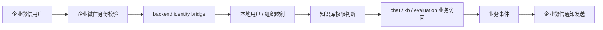

# 企业微信接入 POC

Status: Planned
Owner: runtime / auth / knowledge-base
Last verified: 2026-06-26
Layer: raw-source
Module: Develoments
Feature: EnterpriseIntegration
Doc Type: design

## 单点真相范围

这页只回答一件事：

当前项目如果接入企业微信，第一阶段最小可行 POC 应该做什么。

它覆盖：

- 企业微信对当前桌面 RAG 应用可扩展的能力边界
- 第一阶段 POC 的目标、范围和成功标准
- renderer / preload / backend 的落点建议
- 风险、合规与后续阶段演进方向

它不覆盖：

- 飞书接入细节
- 企业微信全部开放能力的穷举式调研
- 最终生产级权限模型、审计模型和运维方案

相关概念：

- [[CONCEPT_RUNTIME]]
- [[CONCEPT_UCHAT]]
- [[CONCEPT_KNOWLEDGE_BASE]]
- [[AREA_MAP_RUNTIME]]

## Goal

本 POC 的目标不是一次性把企业微信“全面接通”，而是验证：

1. 当前项目能否安全地把企业微信作为外部企业身份与消息入口接进来
2. 企业微信接入后，是否能为聊天、知识库和通知链路带来明确增量价值
3. 现有桌面壳层 + 本地 backend 架构，是否适合承接这类第三方企业集成

## 为什么值得做

对当前项目来说，企业微信最有价值的不是“多一个登录方式”，而是把应用从单机测试工具推向企业内协作工具。

最直接的价值有四类：

- 企业身份：把用户、部门、岗位、离职状态接入现有系统
- 企业消息：优先用企业微信机器人完成通知触达和结果分发，群内协作作为后续扩展
- 企业知识：把企业微信里的群公告、文件、会话衍生材料纳入知识流转
- 企业流程：把知识库导入审核、模型配置审批、告警处置挂到组织流程中

## 能扩展什么能力

### 1. 身份与组织

- 企业微信登录
- 通讯录同步
- 部门 / 成员 / 岗位映射
- 按组织维度控制知识库、模型、工具和评测空间访问范围

### 2. 消息与机器人

- 企业微信应用消息推送
- 群机器人通知入口
- 评测结果、知识库导入结果、运行告警推送
- 人工介入任务通知

### 3. 知识入口

- 把群公告、业务通知、常见问答材料导入知识库
- 把企业微信文件或链接作为知识库导入源
- 记录“哪个部门常问哪些问题”，辅助知识库治理

### 4. 流程与审批

- 新知识库导入审批
- 模型配置变更审批
- 敏感问答复核
- 失败任务分派与提醒

### 5. 检索增强

- 基于部门 / 角色缩小检索范围
- 基于组织关系推荐知识源或责任人
- 在回答里补充“建议联系谁”

## POC 原则

第一阶段必须收窄，不要一开始就碰高风险能力。

POC 原则：

- 先接企业身份和通知，不先接高敏感聊天存档
- 先做 backend 集成，不把企业微信能力散到 renderer
- 先做可验证最小闭环，不先做完整审批平台
- 先做组织信息投影，不先做复杂动态权限引擎

## 本地应用前提

当前项目是本地桌面应用，不自带公网可访问回调域名。

这会直接影响企业微信“网页授权绑定”路线：

- 不能把本地 `localhost` 直接作为正式网页授权回调域名
- 如果要走网页授权绑定，必须额外提供一个企业微信可访问的中转域名和服务端回调能力
- 纯前端静态站不能独立完成完整绑定，因为 `code -> userid` 仍需要服务端安全持有 `Secret`

因此当前项目应明确采用三段式方案：

- 首期稳定方案：
  - 本地应用内手工绑定 `userid`
- POC 验证方案：
  - 可选使用 `Cloudflare Pages + Worker` 做授权中转
- 延后实现：
  - 网页授权绑定主链路
  - 可信域名与回调域名正式落地
- 正式生产方案：
  - 使用中国内地可稳定访问的中转服务承接网页授权

如果当前已经确定用于 POC 的域名是：

- `xxxx.tomz.io`

则具体落地方式见：

- `integrations/wecom-cloudflare-worker-poc.md`

> 注：这条网页授权/Worker 路线当前保留为延后实现，不影响本期以企业微信机器人作为主要消费出口的主线。

## POC Success Criteria

当且仅当以下目标成立时，可认为 POC 成功：

1. 用户可以完成一次企业微信身份绑定
2. backend 可以拉取并保存最小组织信息投影
3. 系统可以把一个业务事件成功推送到企业微信目标用户或群
4. 系统可以基于企业微信组织信息，对至少一个知识库访问场景做权限约束
5. 现有 renderer / preload / backend 边界没有被破坏
6. POC 不引入新的公开网络监听面

## Scope

### In scope

- 企业微信身份绑定：
  - 首期手工绑定
  - 可选网页授权 POC 绑定
  - 机器人 webhook 作为默认通知出口
- 最小通讯录同步：
  - 用户
  - 部门
  - 用户部门关系
- 企业微信应用消息推送
- 一个最小业务场景联动：
  - 推荐优先做“知识库导入完成通知”
    - 这条通知优先走企业微信机器人 webhook
- 一个最小权限场景联动：
  - 推荐优先做“按部门限制知识库可见范围”
- backend 配置、密钥保存和失败日志

### Out of scope

- 会话存档接入
- 群聊天全文索引
- 全量审批流引擎
- 企业微信端完整嵌入式前端
- 复杂多租户设计
- 细粒度 ABAC / PBAC 权限模型
- 飞书统一抽象层

## Recommended First Slice

建议第一条垂直切片只做下面这组能力：

- 企业微信身份绑定
- 通讯录最小同步
- 知识库按部门可见
- 知识库导入完成后推送企业微信通知

原因：

- 这条链路对当前产品最贴近
- 对现有 `auth + knowledge-base + backend event` 边界最友好
- 不需要先处理高敏感会话内容合规
- 可以快速验证“组织身份 + 业务通知 + 权限收敛”三件事

## Target Flow

## 架构落点

### 运行时边界

企业微信集成必须落在 backend，不应直接放到 renderer。

原因：

- 企业微信密钥、token、签名校验属于服务端真相
- 组织结构同步和权限映射属于业务契约，不应放到前端
- renderer 不应直接认识第三方企业平台的 secret 和协议细节
- 当前项目的稳定边界已经要求 renderer 通过 backend 访问业务能力

### Renderer

renderer 只负责：

- 展示企业微信绑定状态
- 发起绑定动作
- 展示同步结果与错误状态
- 展示基于组织权限过滤后的业务结果

renderer 不负责：

- 直接访问企业微信 API
- 保存企业微信 secret
- 自己计算签名或 token

### Preload

preload 不需要新增企业微信专属能力。

除非后续要处理桌面端深链接回调，否则不建议在 POC 阶段扩 preload 暴露面。

### Backend

backend 负责：

- 企业微信凭据配置读取
- token 获取与刷新
- 身份绑定或登录票据校验
- 通讯录最小同步
- 本地组织映射持久化
- 通知发送
- 权限判断接入点

## 建议的数据模型

POC 阶段只保留最小投影，不要先镜像企业微信全量对象。

建议新增或扩展以下概念表：

- `external_identity_bindings`
  - 本地用户 id
  - provider = `wecom`
  - external user id
  - external union id 或稳定标识
  - bind status
- `org_departments`
  - external department id
  - name
  - parent id
- `org_users`
  - external user id
  - display name
  - mobile / email 摘要字段
  - status
- `org_user_departments`
  - external user id
  - external department id
- `knowledge_base_acl`
  - knowledge base id
  - subject type:
    - user
    - department
  - subject id
  - permission

POC 不建议：

- 先复制全部企业微信 profile 字段
- 先引入复杂 group / tag / scope 继承模型

## 最小业务闭环

推荐闭环场景：

### 场景 A：身份绑定

1. 本地用户进入设置页
2. 输入或确认企业微信 `userid`
3. backend 校验该成员是否存在
4. 保存本地用户与企业微信用户映射
5. 页面显示绑定成功

这是首期默认路径。

### 场景 A-2：网页授权绑定 POC

1. 本地用户进入设置页
2. 点击“企业微信授权绑定”
3. 跳到中转网页完成企业微信授权
4. 中转服务完成 `code -> userid`
5. 本地应用拉取绑定结果并保存映射

这条路径只建议作为验证方案，不建议在首期把它当唯一入口。

### 场景 B：知识库部门可见

1. 管理员给知识库配置“某部门可见”
2. 企业微信同步任务拉到部门关系
3. 用户访问知识库时，backend 按本地映射后的部门信息判断权限
4. 非授权用户不能看到该知识库

### 场景 C：导入完成通知

1. 用户发起知识库导入
2. backend 完成导入 / 切块 / embedding
3. backend 发送企业微信机器人通知
4. 用户在企业微信收到结果消息

## Proposed Backend Changes

建议把企业微信接入实现成独立集成域，不要散到现有业务模块内部。

建议新增：

- `server/src/integrations/wecom/config.ts`
- `server/src/integrations/wecom/client.ts`
- `server/src/integrations/wecom/auth.ts`
- `server/src/integrations/wecom/contacts-sync.ts`
- `server/src/integrations/wecom/notifier.ts`
- `server/src/integrations/wecom/types.ts`

建议新增 route：

- `GET /integrations/wecom/status`
- `POST /integrations/wecom/bind/start`
- `POST /integrations/wecom/bind/finish`
- `POST /integrations/wecom/sync/contacts`
- `POST /integrations/wecom/test/send-message`

建议接入点：

- auth：身份绑定
- knowledge-base：访问控制
- job / task / import pipeline：业务通知

## Proposed Frontend Changes

建议只做最小配置和状态展示。

可增加：

- Settings -> Integrations -> 企业微信
- 当前绑定状态
- 最近一次同步状态
- 手动触发同步按钮
- 测试通知按钮

不建议在 POC 里做：

- 完整企业微信管理后台
- 大量组织树可视化
- 独立复杂审批界面

## 安全与合规边界

这部分需要明确告诉项目 owner：即使只是 POC，也不是纯前端小功能。

### 风险级别

这是一个偏架构层接入，不是单点业务 patch。

原因：

- 它引入外部企业身份源
- 它影响权限边界
- 它可能触及员工信息与组织信息处理
- 它会影响知识库访问控制语义

因此如果要从 POC 走向正式实施，后续会涉及核心架构确认。

### POC 阶段规避策略

- 不接会话存档
- 不接敏感聊天全文检索
- 不把企业微信数据直接作为永久知识库默认来源
- 不把本地权限判断完全替换为远端临时查询
- 不开放公网 backend 监听

### Secret 管理

- 企业微信凭据只放 backend
- 不写入 renderer 可见配置
- 不把 access token 写入普通前端日志
- 所有失败日志做脱敏

## 企业微信智能机器人能力边界

这一点需要在 POC 阶段就提前说清楚，否则后续联调时很容易把平台限制误判成我们本地系统缺陷。

### 已确认可行的范围

- 企业微信智能机器人长连接可在本地桌面应用中建立
- 已投递到本地服务的消息，可以进入：
  - 消息解析
  - 知识库检索
  - RAG 生成
  - 回复企业微信

因此，智能机器人这条能力可以成立为：

- 企业微信中的知识库问答入口

### 已确认存在的限制

联调过程中已经出现过这类现象：

- 同一个群里
- 同样是 `@机器人`
- 某些消息可正常进入本地日志
- 某些消息在企业微信客户端已发送，但本地服务完全收不到入站事件

这意味着：

- 企业微信平台侧可能对部分内容做拦截、过滤或不投递处理

一旦消息没有被企业微信投递到本地服务，本地应用就无法：

- 触发 RAG
- 生成回复
- 对这条消息做任何补偿式处理

### POC 阶段应如何表达

因此第一阶段对智能机器人的正式边界定义应为：

> 在企业微信允许投递的消息范围内，提供本地知识库问答入口。

不应承诺：

- 所有 `@机器人` 消息都会稳定到达本地服务
- 所有内容都可绕过企业微信平台侧治理进入本地问答链路
- 企业微信机器人可完全替代本地 Chat 主界面

### 对产品方案的影响

这条边界意味着：

- 企业微信智能机器人适合作为外部入口补充
- Webhook 机器人更适合作为主动通知出口
- 真正需要稳定、完整、可控的问答体验时，仍应回到本地 Chat 主界面

这也是为什么企业微信接入在产品上应定位为：

- 企业入口层

而不是：

- 唯一主交互层

## 验证计划

### Backend

至少验证：

1. 企业微信 token 获取失败时，错误可观测
2. 身份绑定成功后，本地映射写入成功
3. 通讯录同步可以更新最小用户 / 部门投影
4. 部门权限判断能拦住未授权知识库访问
5. 通知发送失败不会破坏主业务事务
6. 机器人 webhook 发送失败时可观测

### Frontend

至少验证：

1. 绑定状态可见
2. 同步状态可见
3. 测试通知结果可见
4. 被权限拒绝的知识库在 UI 上有明确反馈

## Checklist

### 主线 POC

- [ ] 确认 POC 主路线为企业微信机器人 webhook
- [ ] 保留 OAuth / Worker 方案为延后实现
- [ ] 记录 `@all` 不生效问题，后续单独修复
- [ ] 保留成员手工绑定能力
- [ ] 补充“前端设置页如何使用”的说明
- [ ] 跑通一次端到端验证

### 机器人 webhook

- [ ] 填写 `CorpID`
- [ ] 填写 `AgentID`
- [ ] 填写自建应用 `Secret`
- [ ] 填写 `机器人 Webhook URL`
- [ ] 点击保存配置
- [ ] 刷新接入状态
- [ ] 发送一条测试消息
- [ ] 确认企业微信群内收到消息

### 消费方式

- [ ] 约定所有通知先回到 chat 主界面
- [ ] 以外挂插件 / Tool 的方式消费能力
- [ ] 将 WeCom 能力封装为后端可调用工具
- [ ] 前端仅做设置页和状态收口

### 智能机器人长连接

- [ ] 评估企业微信「智能机器人」长连接模式
- [ ] 创建 API 模式机器人
- [ ] 记录 Bot ID 和 Secret
- [ ] 验证本地桌面端是否可直接建立长连接
- [ ] 监听文本 / 图片 / `@机器人` 消息
- [ ] 调用本地智能体推理接口
- [ ] 通过 SDK 主动回复消息
- [ ] 限定可见范围到测试员工 / 部门

## Rollout Plan

### Phase POC-1

- 企业微信配置接入
- 身份绑定
- 最小通讯录同步
- 测试消息发送
- 机器人 webhook 作为默认出口

### Phase POC-2

- 知识库按部门授权
- 知识库导入完成通知
- 手动同步与错误观测
- 评估智能机器人长连接是否替代部分 webhook 场景

### Phase POC-3

- 审批流接入
- 更多业务事件通知
- 检索增强与责任人推荐

## Open Questions

进入正式实施前，至少要回答这些问题：

1. 企业微信身份是“主登录方式”还是“已有本地账号的绑定方式”？
2. 组织信息同步频率是手动、定时还是事件驱动？
3. 知识库权限以部门为主，还是同时支持个人白名单？
4. 通知发送失败是否需要重试队列？
5. 后续是否要支持飞书，从而提前抽象统一 `enterprise-platform` 集成层？

## Recommendation

建议从下面这条最小路径启动：

- 先做企业微信绑定
- 再做最小通讯录同步
- 把部门信息接到知识库 ACL
- 最后把知识库导入完成结果推送到企业微信机器人群

这条路径能最快验证企业微信接入对当前项目是否有真实产品价值，同时又不会过早把系统拖入高敏感消息合规和复杂审批设计。

如果后续只保留一条消费主线，那么就保持“绑定逻辑 + 机器人通知出口”即可，网页授权仍作为可选增强项。
