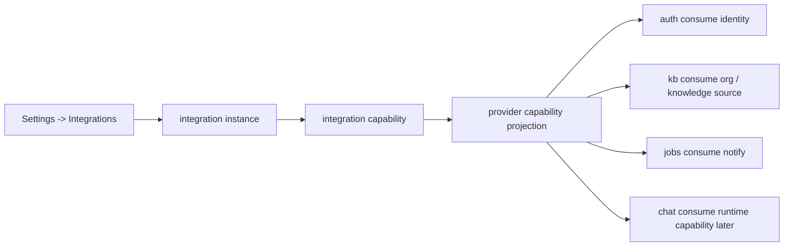

# 第三方集成总架构

Status: Planned
Owner: platform
Last verified: 2026-06-27
Layer: raw-source
Module: Develoments
Feature: EnterpriseIntegration
Doc Type: design

## 单点真相范围

这页只回答一件事：

当前项目如果要系统性接入企业微信、飞书等第三方平台，整体架构应该怎么设计。

它覆盖：

- 第三方集成的总体定位
- backend-first 的模块边界
- provider 注册、instance-capability 模型与能力投影模型
- 数据模型、事件模型和消费链路
- 建议目录结构和分阶段落地顺序

它不覆盖：

- 任一 provider 的具体 API 细节
- 前端像素级视觉规范
- 某个单独 provider 的完整实施步骤

相关文档：

- `integrations/enterprise-wecom-integration-poc.md`
- `integrations/lark-feishu-integration-poc.md`
- `integrations/third-party-integration-frontend-design.md`
- `integrations/third-party-integration-consumption-model.md`
- `integrations/wecom-vs-lark-integration-selection.md`

## Goal

这篇架构文档的目标不是回答“先接谁”，而是回答：

无论先接企业微信还是飞书，项目都应该用什么统一架构来承接这些第三方能力。

这套架构要解决四个问题：

1. 第三方平台能力应该落在哪一层
2. 各业务模块应如何消费这些能力
3. 怎样避免业务层直接依赖 provider 细节
4. 怎样让后续扩平台时不推翻前面设计

## 总体定位

第三方接入在当前项目里，应被理解为一个独立的：

- 企业集成域
- 外部能力接入层

而不是：

- 若干零散的设置页
- 某个单一业务模块里的局部逻辑
- 前端直连第三方 API 的插件功能

它的职责是把外部平台能力统一投影成项目内部可消费的能力。

第三方接入的价值主要集中在四类：

- 身份接入
- 消息通知
- 知识入口
- 流程动作

## 核心架构原则

### 1. backend-first

第三方集成能力必须在 backend 收口。

原因：

- secret 与 token 真相必须在服务端
- 组织结构与权限判断属于业务契约
- 第三方 API 调用、重试、审计、失败恢复都应在 backend
- renderer 不应直接认识 provider 协议细节

### 2. provider 与业务解耦

业务模块不应直接依赖：

- 企业微信 SDK
- 飞书 SDK
- 第三方字段结构

业务模块只应依赖统一能力。

### 3. 本地投影优先

组织、身份、能力开关、同步状态等信息，应优先投影到本地数据模型。

不要把：

- 权限判断
- 资源过滤
- 业务主链路

建立在运行时实时查第三方 API 的基础上。

### 4. 先落 provider，再抽共性

不建议一开始就做一个过度宏大的统一平台抽象。

更稳的顺序是：

1. 先落一个真实 provider
2. 用真实代码和真实场景提炼抽象
3. 再收敛为统一模型

### 5. 配置层和消费层分离

配置发生在：

- `Settings -> Integrations`

消费发生在：

- auth
- knowledge-base
- evaluation / jobs
- chat runtime

### 6. 核心模型平台无关

既然未来不只接企业微信，还会接飞书等其它平台，那么核心模型不应直接写死成 provider 专属结构。

推荐采用：

```text
Integration Provider
  -> Integration Instance
    -> Integration Capability
```

其中：

- `Provider`
  - 平台类型，例如 `wecom`、`lark`
- `Instance`
  - 某个平台中的一个接入实例
- `Capability`
  - 某个实例下挂载的一项能力

企业微信只是首个 provider，而不是核心模型本身。

## 运行时边界

### Renderer

负责：

- 展示 provider 列表与状态
- 发起配置、绑定、同步、测试动作
- 在业务页面展示这些能力已经生效

不负责：

- 保存第三方 secret
- 调用第三方开放平台 API
- 最终权限判断
- provider 协议细节组装

### Preload

POC 阶段尽量不扩 preload。

只有在需要：

- 桌面端深链接回调
- 原生壳层授权回流

时，再最小化扩展。

### Backend

负责：

- provider 配置读取
- token / secret 管理
- 身份绑定与登录校验
- 组织同步与本地投影
- 通知发送
- 知识源接入
- 工作流动作
- 统一能力投影
- 统一事件消费

## 模块结构建议

建议在 backend 新增独立域：

- `server/src/integrations/`

目录草图：

```text
server/src/integrations/
  core/
    capabilities.ts
    provider-registry.ts
    types.ts
    events.ts
    routing.ts
    errors.ts
  wecom/
    config.ts
    client.ts
    auth.ts
    contacts-sync.ts
    notifier.ts
    provider.ts
    types.ts
  lark/
    config.ts
    client.ts
    auth.ts
    contacts-sync.ts
    notifier.ts
    knowledge-source.ts
    provider.ts
    types.ts
```

设计意图：

- `core` 只定义统一抽象
- 各 provider 实现自己的平台细节
- 业务模块只通过 `core` 暴露的能力消费

## Provider / Instance / Capability 模型

### `Provider`

表示第三方平台提供方，例如：

- `wecom`
- `lark`
- `dingtalk`

### `Instance`

表示某个平台中的一个接入实例。

它对应：

- 一个企业
- 一个工作区
- 一个业务域
- 或某个平台中的一套安装 / 连接配置

### `Capability`

表示某个实例下挂载的一项具体能力。

例如：

- `wecom.smart_robot`
- `wecom.webhook_robot`
- `wecom.sales_agent`
- `lark.bot`
- `lark.webhook`
- `lark.knowledge_source`

这个模型的好处是：

- 顶层不被某个平台绑死
- 能自然支持多平台
- 每个平台能力仍然可以按自己的实际类型展开

## Provider 模型

建议每个第三方平台实现一个 provider 对象。

草图：

```ts
export interface IntegrationProvider {
  id: 'wecom' | 'lark';
  displayName: string;
  capabilities: IntegrationCapability[];
  isEnabled(): Promise<boolean>;
}
```

然后再按能力拆更细接口。

例如：

```ts
export interface IdentityProvider {
  startBind(input: StartBindInput): Promise<BindStartResult>;
  finishBind(input: FinishBindInput): Promise<BindFinishResult>;
}

export interface OrgProvider {
  syncUsers(): Promise<SyncResult>;
  syncDepartments(): Promise<SyncResult>;
}

export interface NotifierProvider {
  sendMessage(input: NotifyInput): Promise<NotifyResult>;
}

export interface KnowledgeSourceProvider {
  listSources(input: ListSourcesInput): Promise<KnowledgeSourceSummary[]>;
  pullSource(input: PullSourceInput): Promise<KnowledgeSourcePayload>;
}

export interface WorkflowProvider {
  createAction(input: WorkflowActionInput): Promise<WorkflowActionResult>;
}
```

不是每个平台都必须一开始实现全部接口。

## 能力投影模型

统一能力建议定义为：

```ts
export type IntegrationCapability =
  | 'identity'
  | 'org_sync'
  | 'notify'
  | 'knowledge_source'
  | 'workflow_action';
```

其意义是：

- provider 输出能力
- 业务模块按能力消费

而不是：

- 业务模块按“企业微信”或“飞书”写分支

能力与业务的对应关系建议是：

- `identity`
  - auth
- `org_sync`
  - auth
  - knowledge-base ACL
- `notify`
  - jobs
  - evaluation
  - import pipeline
- `knowledge_source`
  - knowledge-base
  - chat runtime 后续扩展
- `workflow_action`
  - 审批
  - bot / workflow

## 数据模型建议

目标不是镜像第三方全量对象，而是保留本地业务必须依赖的投影。

建议核心表：

### `integration_instances`

记录：

- `provider`
- `name`
- `external_tenant_id`
- `config_json_encrypted`
- `enabled`
- `is_default`
- `created_at`
- `updated_at`

它代表：

- 一个 provider 中的一个接入实例

### `integration_capabilities`

记录：

- `instance_id`
- `provider`
- `type`
- `name`
- `knowledge_base_id`
- `config_json_encrypted`
- `runtime_json`
- `enabled`
- `is_default`
- `created_at`
- `updated_at`

它代表：

- 某个实例下的一项能力挂点

### `external_identity_bindings`

记录：

- 本地用户 id
- provider
- external user id
- union id 或稳定标识
- bind status

### `org_departments`

记录：

- provider
- external department id
- name
- parent id
- status

### `org_users`

记录：

- provider
- external user id
- display name
- email / mobile 摘要字段
- status

### `org_user_departments`

记录：

- provider
- external user id
- external department id

### `integration_sync_jobs`

记录：

- provider
- sync type
- start / finish time
- status
- error summary

### `integration_events`

记录：

- provider
- event type
- target
- status
- retry count
- error summary

### `knowledge_base_acl`

记录：

- knowledge base id
- subject type
- subject id
- permission
- source provider

## 事件模型

第三方能力消费不能让业务模块直接到处调用 provider。

推荐统一事件模型。

业务模块发出领域事件，例如：

```ts
{
  type: 'knowledge_base.import.completed',
  actorUserId: 'u_123',
  payload: {
    knowledgeBaseId: 'kb_1',
    name: '产品手册'
  }
}
```

然后由 `integrations/core/routing.ts`：

- 识别哪些 provider 启用了 `notify`
- 识别该用户是否绑定了第三方身份
- 选择目标 provider
- 调用对应 `NotifierProvider`
- 记录 `integration_events`

这个模型适用于：

- 知识库导入完成
- embedding 失败
- 评测任务完成
- 评测失败
- 审批待处理

## 配置流

配置流建议如下：

1. 用户进入 `Settings -> Integrations`
2. 选择 provider
3. 在 provider 下创建或选择 instance
4. 填写 instance 配置
5. 在 instance 下创建 capability
6. backend 保存 instance / capability 配置
7. 前端展示当前能力摘要和状态

这里的结果不是“配置成功就结束”，而是为后续消费做好前置条件。

## 身份流

建议如下：

1. 用户在账户页或集成详情页发起绑定
2. backend 发起 provider 身份校验流程
3. 校验完成后写入 `external_identity_bindings`
4. 用户账户页可见当前绑定状态
5. auth / ACL / notify 开始消费该绑定信息

## 组织同步流

建议如下：

1. 手动或定时触发同步
2. provider 拉取用户、部门
3. 写入 `org_departments` / `org_users` / `org_user_departments`
4. 更新 `integration_sync_jobs`
5. knowledge-base ACL 和权限过滤开始消费同步投影

## 通知流

建议如下：

1. 业务模块发领域事件
2. `integrations/core` 判断是否存在启用的 `notify`
3. 选择 provider 和目标用户 / 群
4. 调用 provider notifier
5. 记录 `integration_events`
6. 失败时不阻断主业务事务

这是第一阶段最适合落地的消费链之一。

## 知识源流

这类建议放第二阶段。

建议如下：

1. 前端在知识库页展示外部知识源入口
2. backend 通过 `KnowledgeSourceProvider` 拉取候选资源
3. 统一进入现有知识库导入链路
4. 走切块、embedding、索引、通知的标准流程

不要为飞书、企业微信单独重造一套知识处理链。

## 业务消费总图



## 前端入口与后端接口关系

前端建议统一从：

- `Settings -> Integrations`

进入。

后端建议统一提供：

- `GET /integrations`
- `GET /integrations/:provider/instances`
- `POST /integrations/:provider/instances`
- `GET /integrations/:provider/instances/:instanceId`
- `PUT /integrations/:provider/instances/:instanceId`
- `GET /integrations/:provider/instances/:instanceId/capabilities`
- `POST /integrations/:provider/instances/:instanceId/capabilities`
- `POST /integrations/:provider/bind/start`
- `POST /integrations/:provider/bind/finish`
- `POST /integrations/:provider/sync`
- `POST /integrations/capabilities/:capabilityId/test/notify`

这套接口用于：

- 首页列表
- provider 详情
- 显式动作触发

业务模块内部消费则不应直接走这些外部管理接口。

## 第一阶段推荐范围

如果按当前项目节奏，推荐这样落地：

### Phase 1

- `integrations/core` 基座
- 企业微信 provider
- `identity`
- `org_sync`
- `notify`

验证闭环：

- 身份绑定
- 通讯录同步
- 知识库部门可见
- 导入完成通知

### Phase 2

- 飞书 provider
- `knowledge_source`

验证闭环：

- 飞书文档知识源
- 文档导入知识库

### Phase 3

- `workflow_action`
- chat / workflow 更深联动

## 风险提示

这不是单点业务 patch，而是偏架构层改造。

原因：

- 它引入外部身份源
- 它影响权限判断
- 它会进入知识库导入和通知主链
- 它会带来本地投影、重试、审计和失败恢复问题

因此正式实施前，建议把：

- 数据表
- 事件模型
- provider 生命周期
- ACL 语义

单独做一次确认。

## Recommendation

当前项目最稳的第三方集成架构应是：

- 以 backend 为唯一集成真相层
- 以 `server/src/integrations` 为独立域
- 以 `Provider -> Instance -> Capability` 为核心模型
- 以 provider 注册 + 能力投影为统一消费模型
- 以本地投影表作为权限和组织判断依据
- 以事件路由作为通知主消费链
- 以业务模块消费能力而不是消费 provider 细节

这样无论后面先接企业微信还是飞书，都能落在同一套架构里，而不会变成一组零散且不可扩展的第三方适配代码。
