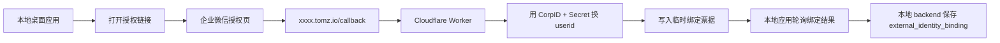

# 企业微信 Cloudflare Worker 绑定 POC

Status: Planned
Owner: runtime / auth / integration
Last verified: 2026-06-27
Layer: raw-source
Module: Develoments
Feature: EnterpriseIntegration
Doc Type: how-to

## 单点真相范围

这页只回答一件事：

如果我们准备用 `xxxx.tomz.io` 做企业微信网页授权中转，`Cloudflare Worker` 应该怎么搭。

它覆盖：

- 域名如何使用
- Worker 应该承接哪些接口
- Secret 怎么放
- 一个最小可跑的 Worker 示例
- 本地桌面应用怎么消费这个绑定结果

它不覆盖：

- 正式生产级高可用设计
- 中国内地网络稳定性保证
- 本地应用最终 UI 细节

相关文档：

- `integrations/enterprise-wecom-integration-poc.md`
- `integrations/wecom-admin-setup-checklist.md`
- `integrations/enterprise-wecom-implementation-checklist.md`

## 目标

这条路线的定位是：

- 用 `xxxx.tomz.io` 验证企业微信网页授权绑定链路
- 不改变“本地应用 + backend-first”的主架构
- 不把企业微信 `Secret` 放进前端
- 当前阶段可先保留方案，不作为主线推进；延后实现也不会影响机器人通知主链路

这是一条 POC 路线，不默认等于正式生产路线。

## 适用前提

你当前已确认：

- 本地环境可以访问 Cloudflare
- 你有一个可用域名：
  - `xxxx.tomz.io`
- 你愿意先验证授权绑定流程，再决定是否保留为长期方案

## 整体链路



关键点：

- 企业微信只回调到 `xxxx.tomz.io`
- `code -> userid` 在 Worker 里完成
- 本地应用不直接暴露公网回调
- 本地应用只拉取“绑定结果”

## 建议域名规划

建议把 `xxxx.tomz.io` 专门拿来做企微授权 POC：

- 授权入口：
  - `https://xxxx.tomz.io/wecom/start`
- 授权回调：
  - `https://xxxx.tomz.io/wecom/callback`
- 绑定结果查询：
  - `https://xxxx.tomz.io/wecom/poll`

如果你更喜欢根路径，也可以写成：

- `https://xxxx.tomz.io/start`
- `https://xxxx.tomz.io/callback`
- `https://xxxx.tomz.io/poll`

但建议保留 `/wecom/*` 前缀，后面更清晰。

## 企业微信后台怎么配

在企业微信自建应用里，网页授权可信域名配置建议填：

- `xxxx.tomz.io`

然后把授权回调地址实际落到：

- `https://xxxx.tomz.io/wecom/callback`

注意：

- 企业微信后台一般配的是域名，不是完整路径
- 真正 `redirect_uri` 用完整 URL

## Worker 要做什么

最小 Worker 只需要做 3 件事：

1. 生成企业微信授权链接
2. 在回调里用 `code` 换 `userid`
3. 存一个短时有效的绑定票据，给本地应用轮询

不要让 Worker 做的事：

- 长期保存完整用户档案
- 直接写你本地 SQLite
- 承担正式组织同步任务

## 建议的环境变量

Worker 至少需要这些变量：

```text
WECOM_CORP_ID=
WECOM_AGENT_ID=
WECOM_APP_SECRET=
WECOM_REDIRECT_URI=https://xxxx.tomz.io/wecom/callback
POLL_TOKEN_SECRET=
```

可选：

```text
DESKTOP_SUCCESS_URL=https://xxxx.tomz.io/wecom/success
```

说明：

- `WECOM_APP_SECRET` 必须放 Worker Secret，不要写进前端
- `POLL_TOKEN_SECRET` 用来签发本地应用轮询票据

## 建议的数据存储

POC 最简单可用的方式：

- Worker KV

KV 存的内容很轻：

- `bindTicket`
- `userid`
- `createdAt`
- `expiresAt`
- `status`

例如：

```json
{
  "status": "ready",
  "userid": "zhangsan",
  "createdAt": "2026-06-27T10:00:00.000Z",
  "expiresAt": "2026-06-27T10:05:00.000Z"
}
```

## Worker 路由设计

### `GET /wecom/start`

输入：

- `state`

作用：

- 生成企业微信 OAuth 链接
- 302 跳转到企业微信授权页

### `GET /wecom/callback`

输入：

- `code`
- `state`

作用：

- 调企微接口拿 `access_token`
- 再用 `code` 换 `userid`
- 写入 KV
- 返回一个“绑定成功，可回桌面应用”的页面

### `GET /wecom/poll`

输入：

- `ticket`

作用：

- 给本地应用查询绑定结果
- 如果成功，返回 `userid`
- 如果未完成，返回 `pending`

## 最小 Worker 示例

下面这份是便于起步的最小版本，基于 Cloudflare Worker。

```ts
export interface Env {
  WECOM_CORP_ID: string;
  WECOM_AGENT_ID: string;
  WECOM_APP_SECRET: string;
  WECOM_REDIRECT_URI: string;
  POLL_TOKEN_SECRET: string;
  WECOM_BIND_KV: KVNamespace;
}

const WECOM_API_BASE = "https://qyapi.weixin.qq.com/cgi-bin";

const json = (data: unknown, init?: ResponseInit) =>
  new Response(JSON.stringify(data, null, 2), {
    status: init?.status ?? 200,
    headers: {
      "content-type": "application/json; charset=utf-8",
      ...init?.headers,
    },
  });

const html = (body: string, init?: ResponseInit) =>
  new Response(body, {
    status: init?.status ?? 200,
    headers: {
      "content-type": "text/html; charset=utf-8",
      ...init?.headers,
    },
  });

const randomId = () => crypto.randomUUID().replace(/-/g, "");

async function getAccessToken(env: Env) {
  const url =
    `${WECOM_API_BASE}/gettoken?corpid=${encodeURIComponent(env.WECOM_CORP_ID)}` +
    `&corpsecret=${encodeURIComponent(env.WECOM_APP_SECRET)}`;

  const response = await fetch(url);
  if (!response.ok) {
    throw new Error(`gettoken http ${response.status}`);
  }

  const data = await response.json<{
    errcode?: number;
    errmsg?: string;
    access_token?: string;
  }>();

  if ((data.errcode ?? 0) !== 0 || !data.access_token) {
    throw new Error(`gettoken failed: ${data.errcode ?? "unknown"} ${data.errmsg ?? ""}`);
  }

  return data.access_token;
}

async function getUserIdByCode(env: Env, code: string) {
  const accessToken = await getAccessToken(env);
  const url =
    `${WECOM_API_BASE}/user/getuserinfo?access_token=${encodeURIComponent(accessToken)}` +
    `&code=${encodeURIComponent(code)}`;

  const response = await fetch(url);
  if (!response.ok) {
    throw new Error(`getuserinfo http ${response.status}`);
  }

  const data = await response.json<{
    errcode?: number;
    errmsg?: string;
    userid?: string;
  }>();

  if ((data.errcode ?? 0) !== 0 || !data.userid) {
    throw new Error(`getuserinfo failed: ${data.errcode ?? "unknown"} ${data.errmsg ?? ""}`);
  }

  return data.userid;
}

export default {
  async fetch(request: Request, env: Env): Promise<Response> {
    const url = new URL(request.url);

    if (url.pathname === "/wecom/start") {
      const ticket = randomId();
      const state = ticket;
      await env.WECOM_BIND_KV.put(
        `bind:${ticket}`,
        JSON.stringify({
          status: "pending",
          createdAt: new Date().toISOString(),
        }),
        { expirationTtl: 300 },
      );

      const authorizeUrl =
        "https://open.weixin.qq.com/connect/oauth2/authorize" +
        `?appid=${encodeURIComponent(env.WECOM_CORP_ID)}` +
        `&redirect_uri=${encodeURIComponent(env.WECOM_REDIRECT_URI)}` +
        `&response_type=code` +
        `&scope=snsapi_base` +
        `&state=${encodeURIComponent(state)}#wechat_redirect`;

      return Response.redirect(authorizeUrl, 302);
    }

    if (url.pathname === "/wecom/callback") {
      const code = url.searchParams.get("code") ?? "";
      const state = url.searchParams.get("state") ?? "";

      if (!code || !state) {
        return html("<h1>Missing code or state</h1>", { status: 400 });
      }

      try {
        const userid = await getUserIdByCode(env, code);
        await env.WECOM_BIND_KV.put(
          `bind:${state}`,
          JSON.stringify({
            status: "ready",
            userid,
            createdAt: new Date().toISOString(),
          }),
          { expirationTtl: 300 },
        );

        return html(`
<!doctype html>
<html>
  <head><meta charset="utf-8"><title>企业微信绑定成功</title></head>
  <body>
    <h1>绑定成功</h1>
    <p>你可以回到本地应用继续完成绑定。</p>
    <p>ticket: ${state}</p>
  </body>
</html>`);
      } catch (error) {
        return html(`
<!doctype html>
<html>
  <head><meta charset="utf-8"><title>企业微信绑定失败</title></head>
  <body>
    <h1>绑定失败</h1>
    <pre>${String(error instanceof Error ? error.message : error)}</pre>
  </body>
</html>`, { status: 500 });
      }
    }

    if (url.pathname === "/wecom/poll") {
      const ticket = url.searchParams.get("ticket") ?? "";
      if (!ticket) {
        return json({ success: false, error: "missing ticket" }, { status: 400 });
      }

      const raw = await env.WECOM_BIND_KV.get(`bind:${ticket}`);
      if (!raw) {
        return json({ success: false, status: "expired" }, { status: 404 });
      }

      const record = JSON.parse(raw) as {
        status: "pending" | "ready";
        userid?: string;
        createdAt: string;
      };

      return json({
        success: true,
        ticket,
        status: record.status,
        userid: record.userid ?? null,
      });
    }

    return json({ success: false, error: "not found" }, { status: 404 });
  },
};
```

## 本地应用怎么配合

本地应用不需要承接公网回调。

建议只做这几个动作：

1. 点“企业微信授权绑定”
2. 请求本地 backend：
   - `POST /integrations/wecom/bind/oauth/start`
3. backend 返回：
   - `authorizeUrl`
   - `ticket`
4. 桌面应用打开浏览器到 `authorizeUrl`
5. 本地应用轮询 backend：
   - `POST /integrations/wecom/bind/oauth/poll`
6. backend 再去请求 Worker：
   - `GET https://xxxx.tomz.io/wecom/poll?ticket=...`
7. 拿到 `userid`
8. 写入本地 `external_identity_bindings`

也就是说：

- 桌面应用只认本地 backend
- 本地 backend 再认 Worker
- 不让 renderer 直接处理企业微信协议细节

## 你实际要做的配置

### Cloudflare 侧

1. 创建一个 Worker
2. 给 Worker 绑定自定义域名：
   - `xxxx.tomz.io`
3. 创建一个 KV Namespace
4. 给 Worker 绑定 KV：
   - `WECOM_BIND_KV`
5. 配置 Secrets：
   - `WECOM_CORP_ID`
   - `WECOM_AGENT_ID`
   - `WECOM_APP_SECRET`
   - `WECOM_REDIRECT_URI`
   - `POLL_TOKEN_SECRET`

### 企业微信后台

1. 在自建应用中配置可信域名：
   - `xxxx.tomz.io`
2. 确认测试成员在应用可见范围内
3. 保留 `AgentID`、`Secret`、`CorpID`

### 本地应用侧

1. 新增 OAuth 启动接口
2. 新增 OAuth 轮询接口
3. 新增“绑定成功后写入本地映射”逻辑
4. 保留手工绑定作为稳定兜底

## 风险说明

这条方案适合 POC，但要明确风险：

- 依赖 Cloudflare 可访问性
- 依赖外部域名回调链路
- 本地能访问，不等于所有内地用户都稳定能访问

所以建议定位为：

- 可验证
- 可演示
- 可做第二入口

但不应直接取消首期手工绑定方案。

## Recommendation

如果你现在就准备用 `xxxx.tomz.io`，最稳的推进方式是：

1. 先在企业微信后台把可信域名配置成 `xxxx.tomz.io`
2. 起一个最小 Worker，只做：
   - `/wecom/start`
   - `/wecom/callback`
   - `/wecom/poll`
3. 本地应用先接轮询绑定结果
4. 手工绑定继续保留

这样你既能验证网页授权链路，又不会把整个本地应用的企业微信接入绑死在 Worker 上。
