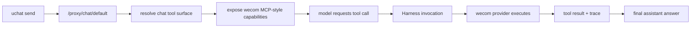

# 企业微信 MCP 封装方案

Status: Planned
Owner: runtime / chat / mcp
Last verified: 2026-06-27
Layer: raw-source
Module: MCP
Feature: EnterpriseIntegration
Doc Type: design

## 单点真相范围

这页只回答一件事：

企业微信能力是否应该封装成当前项目自己的 MCP-style capability，以及应该怎样封装。

它覆盖：

- 为什么这条路是正路
- 为什么第一阶段不建议做成外部独立 MCP server
- 内部 provider 和 MCP-style capability 的关系
- 企业微信插件能力如何投影进 chat runtime

它不覆盖：

- 企业微信所有能力的完整开放清单
- 外部 marketplace 型 MCP server 的完整生命周期设计
- 飞书的同构封装细节

相关文档：

- `integrations/enterprise-wecom-implementation-checklist.md`
- `integrations/third-party-integration-architecture.md`
- `integrations/third-party-integration-consumption-model.md`
- `chat/chat-tool-integration-poc.md`

## Goal

这篇文档要解决的不是“企业微信能不能接”，而是：

如果企业微信能力最终要回到 chat 主界面，以外挂插件形式实施，那么最合适的封装形态是什么。

结论先行：

- 是，封装成我们自己的 MCP-style capability 是正路
- 但第一阶段应是“内部 MCP-style capability”
- 不建议第一阶段直接把企业微信做成一个独立外部 MCP server 再接回项目

## 结论

推荐路线是：

```text
WeCom API
  -> server/src/integrations/wecom/*
  -> internal capability projection
  -> Harness / MCP-style tool
  -> chat runtime
```

不推荐第一阶段走：

```text
WeCom API
  -> 独立外部 MCP server
  -> 再被本项目当 external MCP server 接入
  -> chat runtime
```

## 为什么这是正路

### 1. 最符合当前项目既有架构

当前项目已经有：

- `uchat`
- chat tool loop
- Harness / MCP runtime
- tool execution trace

如果企业微信能力不落在这条路径上，而是单独做一套“企业微信聊天动作系统”，后续一定会出现：

- 双套执行机制
- 双套 trace UI
- 双套权限和错误处理

而封装成 MCP-style capability 后：

- chat 只认识能力
- 不认识企业微信协议
- `uchat` 不需要特判企业微信
- 执行态和失败态可以复用现有设施

### 2. 最适合外挂插件化消费

你已经明确企业微信能力最终还是要回到 chat 主界面。

如果要“以外挂插件形式实施”，那么最自然的形态就是：

- `wecom_notify_send`
- `wecom_org_lookup`

这样的插件能力定义。

这和 MCP 思路天然一致：

- 能力是标准化的
- provider 是可插拔的
- chat 消费的是工具面，而不是平台面

### 3. 更有利于后续扩平台

今天先接企业微信，明天可能接飞书、钉钉。

如果今天企业微信是特判逻辑，后面平台越多，chat runtime 和 backend 里的平台分支会越来越多。

如果今天先封装成内部 MCP-style capability：

- `wecom_notify_send`
- `wecom_org_lookup`

明天飞书也可以按同一路径进入：

- `lark_notify_send`
- `lark_doc_search`

再往后可以逐步抽象成更高层统一能力：

- `notify_send`
- `org_lookup`
- `knowledge_source_search`

### 4. 权限和风险更容易收口

如果直接把企业微信原生 API 暴露成 tool，风险会比较大：

- 权限面过宽
- 模型可调用边界不清
- 审计困难
- 高敏感动作容易误暴露

而如果先封装成自己的 MCP-style capability，就可以明确限制：

- 哪些能力可暴露
- 哪些参数可传
- 哪些用户可用
- 哪些操作只允许发给自己
- 哪些结果只返回摘要

这才符合企业级产品该有的控制面。

## 关键区分

这里有一个很容易混淆的问题：

- “封装成自己的 MCP”
  不等于
- “把企业微信做成一个独立外部 MCP server”

这两件事不是一回事。

## 路线 A：内部 MCP-style capability

含义：

- 企业微信是当前项目 backend 内部的 provider
- 它的能力被投影成内部工具能力
- chat 通过 Harness / tool loop 使用这些能力

特点：

- 简单
- 可控
- 与现有架构贴合
- 不额外引入 transport / discover / connect 生命周期

这应是第一阶段推荐路线。

## 路线 B：外部独立 MCP server

含义：

- 先把企业微信单独做成一个 external MCP server
- 再通过当前项目的 external MCP 机制接回自己

特点：

- 更通用
- 更外部化
- 理论上更易复用

但第一阶段问题也很明显：

- 需要额外 server 生命周期管理
- 需要 transport 管理
- 需要 discover / connect 机制
- 会把“核心业务集成”误导成“外部 marketplace server”
- 会显著增加首期复杂度

因此不建议作为第一阶段主路线。

## 推荐架构

推荐采用两层封装：

### 层 1：内部 provider 层

落在：

- `server/src/integrations/wecom/*`

负责：

- token / secret
- 手工身份绑定
- 组织同步
- 消息发送
- provider 细节

如果后续验证网页授权 POC，可额外增加：

- OAuth relay adapter
- bind ticket polling

### 层 2：能力投影层

落在：

- `server/src/integrations/wecom/plugin-tools.ts`
- `server/src/routes/proxy-provider/chat-tool-surface.ts`
- `server/src/mcp/harness/...`

负责：

- 把 provider 能力投影成 tool / plugin capability
- 暴露给 chat runtime
- 控制 tool id、schema、可见范围和执行权限

## 能力定义建议

第一阶段建议只封装低风险、价值清晰的能力。

## `wecom_notify_send`

用途：

- 向当前已绑定企业微信身份的用户发送消息

第一阶段建议约束：

- 默认仅允许发给自己
- 不支持任意群发
- 不支持自由选择外部目标

输入草图：

```ts
{
  targetType: 'self';
  title?: string;
  content: string;
}
```

输出草图：

```ts
{
  success: boolean;
  target: string;
  summary: string;
}
```

## `wecom_org_lookup`

用途：

- 查询当前用户或单个目标用户的组织摘要

第一阶段建议约束：

- 仅返回摘要
- 不返回批量组织明细
- 不开放复杂搜索

输入草图：

```ts
{
  mode?: 'self' | 'user';
  query?: string;
}
```

输出草图：

```ts
{
  success: boolean;
  departments: Array<{
    id: string;
    name: string;
  }>;
  summary: string;
}
```

## chat runtime 如何消费

消费路径建议如下：



关键点：

- `uchat` 不直接认识企业微信
- chat 只看到 tool capability
- 仍走现有 tool loop 和 execution trace

## 与 `uchat` 的边界

`uchat` 应继续保持现有边界：

- core：状态机
- ui：消息和执行态展示
- integration：协议适配

不要把企业微信字段直接揉进：

- `uchat` core types
- `uchat` runtime logic

企业微信能力只应通过：

- tool execution state
- trace summary

进入 `uchat` 展示层。

## 与 external MCP marketplace 的关系

第一阶段不要把企业微信能力放进：

- external MCP marketplace
- Settings -> MCP 已安装 server

原因：

- 企业微信是核心业务集成，不是一般外部 marketplace server
- 它属于项目内的第三方集成域
- 更适合走 `Settings -> Integrations`

后续如果要把企业微信能力外部化为独立 MCP server，那应该是第二阶段或更后面的能力复用议题，而不是首期接入方式。

## 风险控制建议

第一阶段应当限制：

- 不开放任意目标发送
- 不开放复杂组织数据枚举
- 不开放审批动作创建
- 不开放高敏感组织搜索
- 不把 provider 原始错误直接暴露给用户

所有 MCP-style capability 都应：

- 有明确 schema
- 有明确可见条件
- 有明确权限边界
- 有明确 trace 记录

## 推荐实施顺序

### Step 1

- 企业微信 provider 基础实现
- 配置、绑定、同步、通知

### Step 2

- `wecom_notify_send`
- `wecom_org_lookup`
- `plugin-tools.ts`

### Step 3

- 接入 chat tool surface
- 接入 Harness invocation
- 接入 `uchat` 执行态展示

### Step 4

- 根据真实使用情况决定是否抽更高层能力：
  - `notify_send`
  - `org_lookup`

### Step 5

- 再评估是否有必要外部化为独立 MCP server

## Recommendation

企业微信能力封装成我们自己的 MCP-style capability 是正路。

但第一阶段的正确做法不是把它做成一个独立 external MCP server，而是：

- 先作为 backend 内部 provider 实现
- 再投影成内部 MCP-style capability
- 由 chat 主界面通过插件能力消费
- 继续复用现有 Harness、tool loop、trace 和 `uchat`

这样既能拿到 MCP 统一工具面的好处，又不会在首期把复杂度推到 external MCP server 生命周期和 marketplace 体系上。
