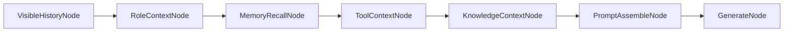
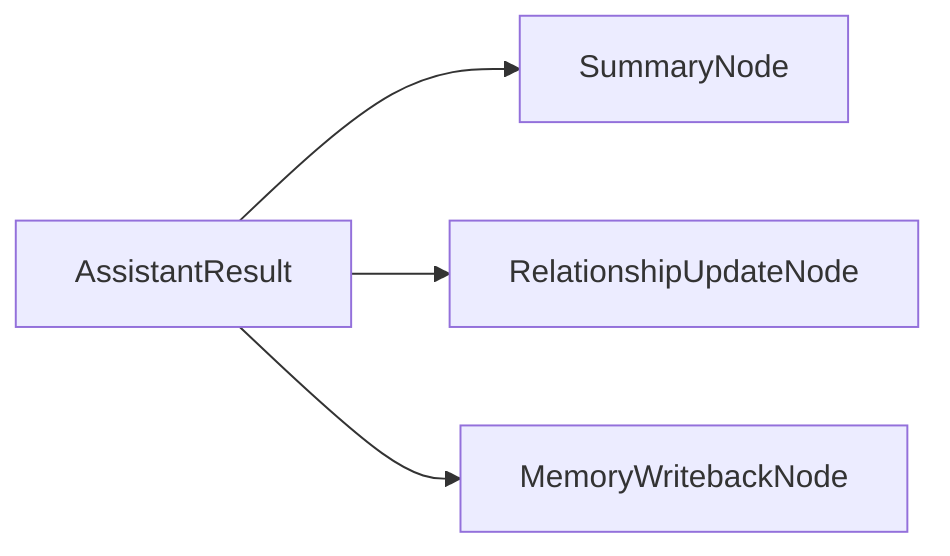
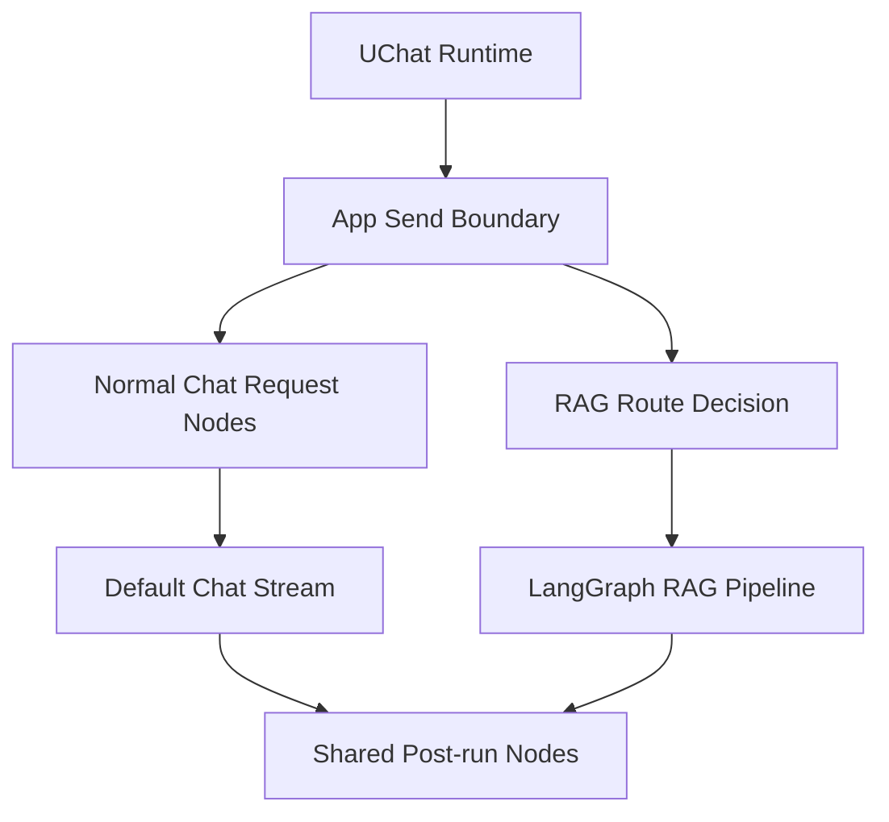

# 普通聊天最小节点化方案

## 1. 这份文档回答什么

这份文档只回答一个现实问题：

> 既然 `rag-demo` 的 RAG 已经接入 LangGraph，普通聊天还保持线性直发，会出什么问题？我们现在最小应该怎么改？

这里讨论的是：

- 普通 `chat/completions` 聊天
- Role 注入
- 未来的 tool / summary / memory / MCP / skills 接法
- `uchat` 和当前后端两条聊天链路的约束

这里不讨论：

- 具体 provider 参数差异
- 向量召回算法细节
- 工具执行器的实现细节

## 2. 当前真实现状

### 2.1 前端 `uchat` 边界

`uchat` 的核心定位已经很清楚：

- 它是聊天 runtime
- 它负责线程、消息、发送、流式消费
- 它不应该理解 Role、知识库、工具规则、prompt 编排

也就是说，Role prompt assembly 不能塞进：

- `desktop/src/shared/uchat/core/*`

它应该放在应用层发送边界，也就是：

- `desktop/src/features/chat/core/*`

### 2.2 普通聊天当前仍是线性直发

当前普通聊天发送入口在：

- `desktop/src/features/chat/core/protocol.ts`

核心请求还是：

```ts
messages: toProxyMessages([...context.history, context.message])
```

这说明现在发送给后端的只有：

- 可见历史
- 当前用户消息

没有真正的 request assembly 层。

### 2.3 后端现在是两条聊天链路

当前后端入口在：

- `server/src/routes/proxy-provider/chat.routes.ts`

真实分成两条：

1. 普通默认聊天
   直接走 `providerProxyService.createPersistedChatStream(...)`
2. 绑定知识库的默认聊天
   转进 `createRagAssistantStream(...)`，再走 `ragPipeline.assistantStream(...)`

### 2.4 RAG 路径已经是图式编排

RAG 主流程已经明确使用：

- `server/src/services/rag-graph.ts`
- `server/src/services/rag-pipeline.ts`

而且 `toRagInput(messages)` 会把历史里的 `system` 过滤掉。

这意味着：

- 普通聊天塞什么 `system`
- RAG 路径塞什么 `system`
- 哪些东西属于可见消息，哪些属于请求态上下文

这些边界必须先设计清楚。

## 3. 普通聊天如果继续做“特殊线性链路”，问题会在哪里

### 3.1 Tool 很快会把线性链路打穿

一旦接工具，普通聊天至少会出现这些阶段：

1. 读取可见历史
2. 组装角色和工具规则
3. 发起模型生成
4. 判断是否要调工具
5. 执行工具
6. 回填工具结果
7. 二次生成答案

这已经不是“把 `messages` 直接 POST 出去”能稳定承载的复杂度了。

### 3.2 摘要和记忆不是简单字段，而是真节点

不管我们叫它“摘要”“关系状态”“记忆写回”，只要它满足这些特征，它就已经是节点：

- 有明确输入
- 有明确输出
- 可能依赖模型
- 可能依赖外部存储
- 需要可观测和可重试

所以它不应该散成一堆发送前后的隐式副作用。

### 3.3 后面会出现越来越多的单一能力节点

你前面已经明确过，希望未来每个 LLM 服务都是单一功能节点。那普通聊天如果继续保持特殊分支，后续会很难和这些节点对齐：

- summary node
- memory recall node
- memory writeback node
- embedding node
- tool selection / tool execution node
- MCP / skill 调度节点

### 3.4 RAG 和普通聊天会越来越难共享能力

如果 RAG 已经是节点生态，而普通聊天还是硬编码直发，后面共享这些能力会很痛：

- 同一套 Role request assembly 需要写两份
- 同一套工具规则需要写两份
- 同一套摘要/记忆更新策略需要写两份
- 调试时一条链有节点事件，另一条链没有

这会让“普通聊天”变成最难维护的那条链，而不是最简单的那条链。

## 4. 但现在要不要立刻把普通聊天整个搬到 LangGraph

我的结论是：

- 不建议现在立刻全量搬
- 但必须现在就按节点契约来收口

原因很简单：

- 前端 `uchat` 现在已经跑稳，不能为了 prompt manager 反向侵入 core
- 后端默认聊天流现在也已经能持久化、流式回包、自动标题
- 如果这时直接把普通聊天整条链重写成图，风险太高

所以更稳的路径是：

1. 先把普通聊天改成“节点化接口 + 线性执行器”
2. 保持现有普通聊天传输与持久化主路径
3. 等 tool / summary / memory 都落地后，再决定是否整体切到 LangGraph runtime

## 5. 最小节点化目标

当前普通聊天最小应该做到的，不是“全面图化”，而是三件事：

### 5.1 前端有 request assembly 节点链

负责把这些输入拼成统一请求消息：

- 可见历史
- 当前用户消息
- Role 稳定骨架
- 线程内动态状态
- 工具规则
- 记忆召回
- 知识块
- 尾部强化提示

### 5.2 后端有 post-run 节点链

负责在模型回复完成后做：

- 摘要更新
- 关系状态更新
- 记忆写回
- 工具结果副作用收敛

### 5.3 两边共享同一套节点输入输出契约

即使现在前端和后端分别执行不同节点，也要先把契约定住：

- 输入对象长什么样
- 节点产物长什么样
- 哪些属于 request path
- 哪些属于 post-run path

这样后面要不要接 LangGraph，只是执行器替换问题，不是语义重写问题。

## 6. 推荐的普通聊天最小节点集

### 6.1 Request path 节点



#### `VisibleHistoryNode`

输入：

- 当前线程真实历史
- 当前用户消息

输出：

- 只包含可见 `user / assistant` 的线性消息

职责：

- 不掺 request-only prompt
- 不掺角色骨架
- 不掺工具规则

#### `RoleContextNode`

输入：

- 当前选中的 Role
- 线程级角色动态状态（如果以后有）

输出：

- request-only 的角色上下文块

职责：

- 把稳定角色骨架和线程内动态状态编译成可注入块
- 不直接改写可见 history

这里要特别说明：

- “线程内动态状态”只是实现候选层，不等于产品已经确认了“成长态”字段结构
- 文档里提这个层，是为了给后面的摘要/记忆更新留边界

#### `MemoryRecallNode`

输入：

- 当前用户问题
- 近期历史
- 线程标识

输出：

- 少量可注入记忆块

职责：

- 只负责召回和压缩
- 不负责把记忆写回数据库

#### `ToolContextNode`

输入：

- 当前可用工具
- 当前聊天模式
- 当前角色的工具使用规则

输出：

- 可供模型理解的工具上下文块

职责：

- 说明当前能调用哪些工具
- 说明什么时候该用、不该用、不能假装用

这里不要发明新黑话，直接叫：

- `available tools`
- `tool usage rules`

#### `KnowledgeContextNode`

输入：

- 当前线程是否绑定知识块
- 当前可注入的非 RAG 背景知识

输出：

- request-only knowledge blocks

职责：

- 这是普通聊天侧可选节点
- 不等同于后端 RAG graph 检索节点

#### `PromptAssembleNode`

输入：

- 前面所有 request path 节点的结果

输出：

- 最终要发送的统一 `request messages`

职责：

- 做顺序编排
- 做 depth injection
- 做 token budget trimming

它是这条链的核心节点。

#### `GenerateNode`

输入：

- `request messages`

输出：

- 模型流式回复

职责：

- 当前阶段仍然复用现有普通聊天发送链路
- 不负责摘要、记忆、关系更新

### 6.2 Post-run 节点



这些节点不是首版必须全做，但边界现在就该定好。

#### `SummaryNode`

它可以被视为近似纯函数节点：

- 输入：历史片段 + 本轮问答
- 输出：新的摘要文本或摘要 patch

但工程上它未必是严格纯函数，因为：

- 可能调模型
- 可能读旧摘要
- 可能写存储

所以更稳的拆法是：

- `SummaryComputeNode`
- `SummaryPersistStep`

#### `RelationshipUpdateNode`

如果后面我们要实现“角色长期稳定且有变化感”，这里就是更合适的落点。

它不一定叫这个名字，但它表达的是：

- 根据本轮对话更新线程级角色状态

这层现在先留接口，不强行产品化命名。

#### `MemoryWritebackNode`

输入：

- 本轮问答
- 工具结果
- 线程上下文

输出：

- 需要写入长期记忆系统的结构化记录

这层以后很可能还会接：

- embedding node
- memory store node

## 7. 普通聊天和 RAG 现在怎样共生态但不强行共运行时

推荐这样拆：



含义是：

- `uchat` 只负责聊天 runtime，不负责 prompt 编排
- 普通聊天在前端发送边界先做 request assembly
- RAG 继续走现有后端 LangGraph
- 两条链最终尽量共享 post-run 节点契约

这比“现在就把所有东西都塞进一个超级图”更稳。

## 8. Role 插在普通聊天哪里最合适

普通聊天里，Role 不应该写进可见线程消息。

它应该进：

- `RoleContextNode`
- 然后由 `PromptAssembleNode` 放进 request-only messages

推荐顺序：

```text
system: agent policy
system: role anchor
system: thread-level role state (optional future layer)
system: memory recall
system: available tools / tool usage rules
system: knowledge context
history...
system: near-tail reinforcement
user: latest user input
```

这个顺序的核心意图是：

- 稳定身份在前
- 动态补充在中
- 强化提示贴近尾部
- 最新用户问题最后出现

## 9. 为什么这套方案对 `uchat` 影响最小

因为它不改 `uchat` core 的职责。

它只在发送边界新增一层：

- 从 `context.history + context.message`
- 变成 `buildRequestMessagesFromChatContext(...)`

也就是说：

- `uchat` 还是只管聊天 runtime
- feature 层负责项目专属 prompt 编排
- 后端仍然吃统一消息数组

这符合现在项目里已经定下来的分层。

## 10. 近期实施计划

### 阶段 1

前端先补普通聊天 request assembly，不改后端主协议：

- 新增 `features/chat/prompt-manager/*`
- 先只接 Role
- 暂不接 memory/tool/summary 真节点
- 输出仍然是当前后端能吃的 `messages`

### 阶段 2

补普通聊天 post-run hooks：

- assistant 完成后触发 summary/update/memory 的占位流程
- 先定输入输出，不一定当场上全部生产逻辑

### 阶段 3

当 tool / memory / summary 都进入实装后，再评估：

- 普通聊天是否迁到 LangGraph
- 还是保留线性执行器，但复用同一套节点契约

## 11. 一句话结论

普通聊天现在不一定要立刻接入 LangGraph runtime，但必须立刻进入同一个节点生态。

否则后面一旦把 Role、tools、summary、memory、MCP、skills 都接上来，普通聊天会变成整套系统里最难维护、最难观测、最难复用能力的那条链。
