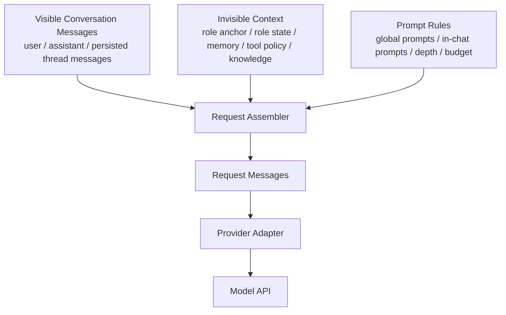
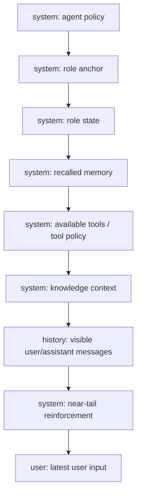
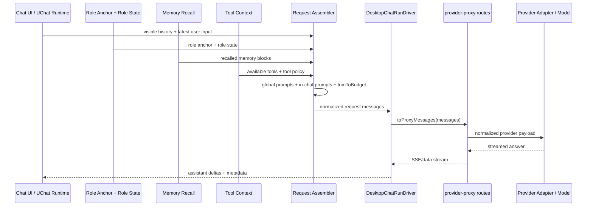

# Prompt Manager Integration for `rag-demo`

Status: Current
Owner: runtime
Last verified: 2026-06-26
Layer: raw-source
Module: tooling-runtime
Doc Type: design

## 1. 目标

本文件回答一个具体问题：

> `docs/prompt-manager-rules/src/request-message-builder.js` 这套核心代码，如何接入当前 `rag-demo` 项目的聊天主链路？

这里讨论的是：

- 普通 `chat/completions` 聊天
- 前端 request message 组装
- Role / Agent / Tool / Memory 的放置层次

这里不讨论：

- provider-specific 请求体差异
- MCP 工具调度细节
- 向量记忆召回算法本身

## 2. 先定边界

当前项目必须保持两套消息流分离：



### 2.1 可见消息

- 线程里真实存在的 `user / assistant` 消息
- 用于 UI 渲染
- 用于线程持久化

当前来源：

- `desktop/src/shared/uchat/core/runtime.ts`
- `server/src/routes/proxy-provider/message-persistence.ts`

### 2.2 请求消息

- 每次发送前临时拼装出来的 messages
- 包含 role / memory / knowledge-base / tool policy 等不可见上下文
- 只发送给模型

当前项目里，这一层还没有真正接入主链路。

## 3. 这套核心代码现在做了什么

`request-message-builder.js` 的结构已经很接近最终形态：

### 3.1 `buildGlobalPromptBlocks`

负责放在 history 之前的稳定块：

- `systemPrompt`
- `character.description`
- `character.personality`
- `character.scenario`
- `summary`
- `worldInfoMatches`
- `dynamicBlocks(placement=global)`

这是“全局锚点层”。

### 3.2 `buildVisibleHistory`

只读取真实对话历史，并附加当前最新用户输入。

这一点非常重要：

- request-only prompts 不进入这里
- 它只应该吃真实聊天消息

### 3.3 `buildInChatPrompts`

负责构建按 `depth` 插入历史附近的动态块：

- `postHistoryInstructions`
- `promptConfig.inChatPrompts`
- `dynamicBlocks(placement=in_chat)`

这是“近尾强化层”。

### 3.4 `injectInChatPrompts`

按“从尾部往前数”的语义插入：

- `depth = 0`：最贴近最近一轮
- `depth = 1`：离最近一轮再远一点

### 3.5 `trimToBudget`

先保：

- global prompts
- 最新用户消息

再裁：

- 老的 history

这对长对话稳定人设很关键。

## 4. 接到我们项目时，哪些概念要改名

为了避免后续实现时语义漂移，建议在 `rag-demo` 里把输入概念重新命名。

### 4.1 `character`

在 `rag-demo` 里不要继续沿用 SillyTavern 语义的 `character`。

建议拆成：

```ts
type RoleAnchor = {
  roleId: string;
  name: string;
  description: string;
  worldview: string;
  persona: string;
  scenario: string;
  style: string;
  constraints: string;
  exampleDialogues: string;
};
```

这里的 RoleAnchor 是稳定骨架，不是会成长的线程状态。

### 4.2 `summary`

当前示例里的 `summary` 已经在承担“成长中的角色状态”。

建议在 `rag-demo` 里不要继续叫笼统 `summary`，而改为：

```ts
type RoleState = {
  relationshipSummary: string;
  trustSummary?: string;
  activeTension?: string;
  stableShifts?: string[];
};
```

也就是说：

- `summary` 不再只是摘要
- 它是线程内成长出来的人设状态

### 4.3 `dynamicBlocks`

建议在 `rag-demo` 里把它理解成：

- request-time dynamic reinforcements
- 不是 role 本体
- 不是 history
- 不是 provider adapter 逻辑

它适合承载：

- Author Note
- 当前轮行为强化
- 某个阶段性提醒
- 某个工具调用前后的行为限制

## 5. 在我们项目里应拆成哪几层

当前最稳的落地层级如下：

### 5.1 Agent Policy

放系统级通用执行原则：

- 不伪造工具执行
- 高风险问题优先验证
- 不把未验证结论写成事实

这不是 Role。

### 5.2 Role Anchor

放长期稳定的人设骨架：

- 身份
- 世界观
- 人格
- 场景
- 风格
- 约束

### 5.3 Role State

放线程内逐步成长的人设状态：

- 当前关系
- 当前信任程度
- 当前 tension
- 最近形成的稳定变化

### 5.4 Memory Recall

放向量记忆/长期记忆召回结果：

- 已发生事件
- 偏好
- 承诺
- 隐藏信息

### 5.5 Tool Policy / Available Tools

分两部分：

- 当前可用工具能力说明
- 当前角色使用工具的规则

### 5.6 Visible History

只放真实可见聊天消息。

### 5.7 In-Chat Reinforcements

贴近尾部的注入块，用于让长对话不漂。

## 6. 推荐的请求消息结构

普通聊天建议按这个顺序组装：

```text
system: agent policy
system: role anchor
system: role state
system: recalled memory
system: available tools / tool policy
history...
system: near-tail reinforcement
user: latest user input
```



其中：

- `role anchor` 默认属于 global prompts
- `role state` 默认属于 global prompts
- `memory recall` 默认属于 global prompts
- `tool policy` 默认属于 global prompts
- `near-tail reinforcement` 属于 in-chat prompts

## 7. 这套核心代码怎么接到当前 chat 主链路

当前真实发送链路在：

- `desktop/src/features/chat/core/protocol.ts`

现在的代码是：

```ts
messages: toProxyMessages([...context.history, context.message])
```

这说明当前只发：

- history
- latest user message

没有 request assembly。

### 7.1 推荐改造点

不要在后端插。

不要在 provider adapter 插。

应该在前端发送前插，也就是在 `DesktopChatRunDriver.run(...)` 里，把：

```ts
[...context.history, context.message]
```

替换为：

```ts
buildRequestMessagesFromChatContext(...)
```

再把产物送进 `toProxyMessages(...)`。



## 8. 推荐新增的前端模块

建议新增：

```text
desktop/src/features/chat/prompt-manager/
  buildRequestMessages.ts
  compileRoleAnchor.ts
  compileRoleState.ts
  compileMemoryBlocks.ts
  compileToolPolicy.ts
  compileInChatReinforcements.ts
  types.ts
```

其中核心入口建议是：

```ts
buildRequestMessagesFromChatContext(input: {
  history: ChatMessage[];
  latestUserMessage: ChatMessage;
  role?: RoleSummary | null;
  roleState?: RoleState | null;
  memoryRecall?: MemoryRecallResult | null;
  availableTools?: ToolDescriptor[];
  triggerType?: "normal" | "continue" | "regenerate";
  tokenBudget?: number;
}): PromptInjectionMessage[]
```

## 9. 为什么不直接把这份 JS 原样搬过去

因为这份参考实现有两个混合点，到了 `rag-demo` 里最好拆开：

### 9.1 `character` 同时承担了 role anchor 和部分 role state

这会让“角色骨架”和“线程成长态”混在一起。

### 9.2 `summary` 语义过宽

它既像对话摘要，也像关系状态，还可能像长期记忆压缩。

在 `rag-demo` 里最好拆成：

- `conversationSummary`
- `roleState`
- `memoryRecall`

## 10. 接向量记忆时怎么放

向量记忆不应直接进入 role anchor。

推荐流程：

1. 先根据最新用户输入 + 线程上下文召回 memory candidates
2. 再把 candidates 压缩成少量 memory blocks
3. 最后作为 `global prompts` 注入

只有少量“与当前轮极强相关的回忆”适合转成 `in-chat prompt`

## 11. 接工具时怎么放

工具不要直接写进 Role 本体。

应分成：

- `availableTools`
- `toolPolicy`

其中：

- `availableTools` 是环境能力
- `toolPolicy` 是本轮或长期的工具使用规则

这层推荐放在 global prompts，但当前轮特别强的限制可以作为 in-chat reinforcement

## 12. 我们下一步真正要做的事

不是直接把这份 JS 搬进生产，而是按当前项目边界做一次“语义拆分”：

1. 先定义 `RoleAnchor`
2. 再定义 `RoleState`
3. 再定义 `MemoryRecallResult`
4. 再定义 `ToolPolicy`
5. 最后做 `buildRequestMessagesFromChatContext(...)`

只有这样，后面角色成长、向量记忆、工具调用接进来时才不会互相覆盖。

## 13. 一句话结论

`docs/prompt-manager-rules/src/request-message-builder.js` 这套核心代码可以接进 `rag-demo`，但不能原样照搬字段语义。

它应该保留：

- layered prompt placement
- request-only assembly
- depth insertion
- trim old history before identity

同时改造成适合 `rag-demo` 的 6 层输入：

- agent policy
- role anchor
- role state
- memory recall
- tool policy
- visible history
