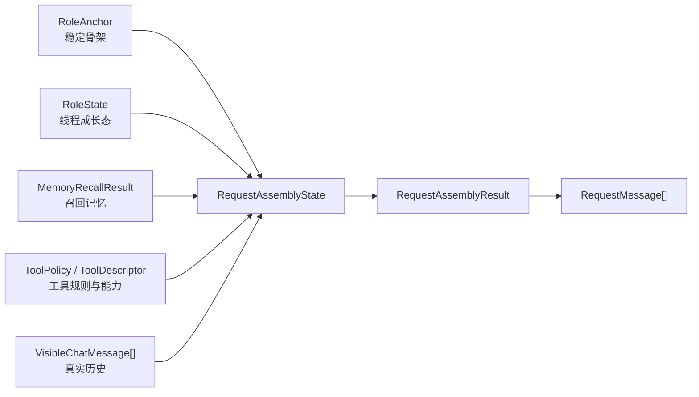
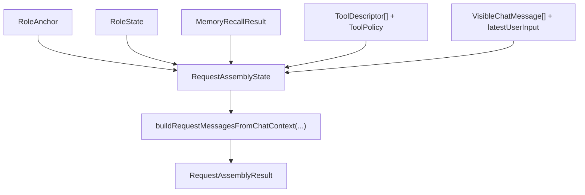
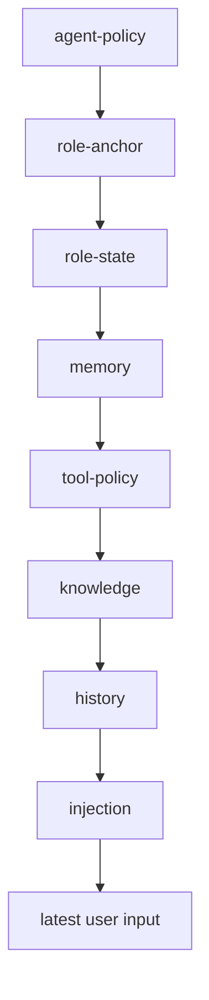

# `rag-demo` Prompt Manager Types Draft

Status: Current
Owner: runtime
Last verified: 2026-06-26
Layer: raw-source
Module: Tool
Feature: PromptManager
Doc Type: draft

> 这份文档只做一件事：把后续实现里最容易混掉的概念先定成清晰的类型。

## 1. 目标

我们后面要做的不是“把一堆 prompt 字符串拼起来”，而是先把输入状态分清楚，再做 request assembly。



这份草案只定义：

- 哪些数据属于 Role
- 哪些数据属于线程成长态
- 哪些数据属于记忆召回
- 哪些数据属于工具规则
- 最终 request builder 应该吃什么

## 2. 最小消息类型

```ts
export type RequestMessageRole = "system" | "user" | "assistant";

export type RequestMessageKind =
  | "agent-policy"
  | "role-anchor"
  | "role-state"
  | "memory"
  | "tool-policy"
  | "knowledge"
  | "history"
  | "injection";

export interface RequestMessage {
  id?: string;
  role: RequestMessageRole;
  content: string;
  kind: RequestMessageKind;
}
```

## 3. 可见聊天消息

这类消息：

- 进入线程存储
- 进入 UI
- 是 request builder 的真实 history 输入

```ts
export interface VisibleChatMessage {
  id: string;
  role: "user" | "assistant" | "system";
  content: string;
  createdAt: string;
  metadata?: Record<string, unknown>;
}
```

## 4. Role Anchor

Role Anchor 是角色的稳定骨架。

特点：

- 跨线程可复用
- 不随着单次对话轻易变化
- 用于定义“这个角色是谁”

```ts
export interface RoleAnchor {
  roleId: string;
  name: string;
  summary: string;
  avatarId: string | null;
  description: string;
  worldview: string;
  persona: string;
  scenario: string;
  style: string;
  constraints: string;
  exampleDialogues: string;
}
```

## 5. Role State

Role State 是线程内逐渐成长出来的人设状态。

特点：

- 与具体线程绑定
- 会被阶段推进、总结器、记忆系统影响
- 不应直接覆盖 Role Anchor

```ts
export interface RoleState {
  threadId: string;
  roleId: string;
  relationshipSummary: string;
  trustSummary?: string;
  activeTension?: string;
  stableShifts?: string[];
  currentGoals?: string[];
  currentWarnings?: string[];
  updatedAt: string;
}
```

### 说明

- `relationshipSummary`
  描述当前角色与用户的关系阶段
- `trustSummary`
  描述信任程度或防备程度
- `activeTension`
  描述当前未解决的紧张点
- `stableShifts`
  描述已经形成的长期变化

## 6. Memory Recall

Memory Recall 不是数据库里的原始向量 chunk，而是召回后压缩好的可注入记忆块。

```ts
export type MemoryRecordType =
  | "event"
  | "relationship"
  | "preference"
  | "promise"
  | "fact";

export interface MemoryRecallRecord {
  id: string;
  type: MemoryRecordType;
  summary: string;
  score: number;
  source?: string;
}

export interface MemoryRecallResult {
  query: string;
  records: MemoryRecallRecord[];
  generatedAt: string;
}
```

### 说明

- `summary` 必须是压缩后的可注入文本，不是原始长文
- `score` 用于调试和裁剪，不直接展示给模型

## 7. Tool Descriptor

工具能力和角色是两回事。

这层只说明“当前有什么工具可用”。

```ts
export type ToolAvailability = "enabled" | "disabled";

export interface ToolDescriptor {
  name: string;
  label: string;
  purpose: string;
  availability: ToolAvailability;
  requiresConfirmation?: boolean;
}
```

## 8. Tool Policy

Tool Policy 不是工具定义本身，而是当前 request builder 想传达给模型的工具使用规则。

```ts
export interface ToolPolicy {
  preferVerification: boolean;
  preferSmallExperiments: boolean;
  explainToolUseBriefly: boolean;
  neverFakeToolUsage: boolean;
  avoidUnnecessaryToolCalls: boolean;
  customRules?: string[];
}
```

## 9. Knowledge Context

这层和 Role 分开，避免未来知识库/RAG 上下文污染角色本体。

```ts
export interface KnowledgeContextBlock {
  id: string;
  title: string;
  content: string;
  source?: string;
}
```

## 10. Dynamic Injection Block

这是最接近你现在 `dynamicBlocks` 的结构。

```ts
export type InjectionPlacement = "global" | "in_chat";

export interface DynamicInjectionBlock {
  id: string;
  placement: InjectionPlacement;
  role?: RequestMessageRole;
  content: string;
  enabled?: boolean;
  triggers?: Array<"normal" | "continue" | "regenerate" | "impersonate" | "quiet">;
  depth?: number;
  order?: number;
}
```

## 11. Prompt Config

这层属于编排器配置，不是角色卡本体。

```ts
export interface PromptConfig {
  systemPrompt?: string;
  postHistoryInstructions?: string;
  variables?: Record<string, string>;
  inChatPrompts?: DynamicInjectionBlock[];
}
```

## 12. Request Assembly State

这是 request builder 最终吃的统一输入。

```ts
export interface RequestAssemblyState {
  conversationId?: string;
  threadId?: string;
  triggerType: "normal" | "continue" | "regenerate" | "impersonate" | "quiet";
  latestUserInput: string;
  latestUserMessageId?: string;
  tokenBudget: number;
  userName: string;
  assistantName: string;
  roleAnchor?: RoleAnchor | null;
  roleState?: RoleState | null;
  memoryRecall?: MemoryRecallResult | null;
  availableTools?: ToolDescriptor[];
  toolPolicy?: ToolPolicy | null;
  knowledgeBlocks?: KnowledgeContextBlock[];
  history: VisibleChatMessage[];
  dynamicBlocks?: DynamicInjectionBlock[];
  promptConfig?: PromptConfig;
}
```



## 13. 编译结果

```ts
export interface RequestAssemblyResult {
  messages: RequestMessage[];
  rawPrompt: string;
  tokenEstimate: number;
}
```

## 14. 推荐的 builder 接口

```ts
export function buildRequestMessagesFromChatContext(
  state: RequestAssemblyState,
): RequestAssemblyResult;
```

## 15. 编译子函数建议

后面实现时建议拆成这些纯函数：

```ts
export function compileAgentPolicy(): RequestMessage[];

export function compileRoleAnchor(
  roleAnchor: RoleAnchor | null | undefined,
): RequestMessage[];

export function compileRoleState(
  roleState: RoleState | null | undefined,
): RequestMessage[];

export function compileMemoryRecall(
  memoryRecall: MemoryRecallResult | null | undefined,
): RequestMessage[];

export function compileToolContext(
  availableTools: ToolDescriptor[] | undefined,
  toolPolicy: ToolPolicy | null | undefined,
): RequestMessage[];

export function compileKnowledgeBlocks(
  knowledgeBlocks: KnowledgeContextBlock[] | undefined,
): RequestMessage[];

export function compileVisibleHistory(
  history: VisibleChatMessage[],
  latestUserInput: string,
  latestUserMessageId?: string,
): RequestMessage[];

export function compileDynamicInjections(
  state: RequestAssemblyState,
): Array<RequestMessage & { depth: number; order: number }>;
```

## 16. 最终消息顺序

普通 `chat/completions` 聊天建议顺序：

```text
system: agent policy
system: role anchor
system: role state
system: memory recall
system: tool context / tool policy
system: knowledge context
history...
system: near-tail reinforcement
user: latest user input
```



## 17. 明确哪些东西不要混

### 不要把这些混进 `RoleAnchor`

- 当前关系
- 当前信任变化
- 当前轮工具要求
- 某次召回的记忆

### 不要把这些混进 `history`

- 前置 system prompt
- 角色骨架
- 长期记忆块
- 工具规则
- author note

### 不要把这些混进 provider adapter

- Role 数据库读取
- 角色排序规则
- history depth 插入规则
- prompt trimming 策略

## 18. 一句话结论

如果我们先把这些类型定住，后面的 request assembly、角色成长、工具接入、向量记忆接入就会顺很多。

这份草案的目的不是一次定死所有字段，而是先把最容易互相污染的语义拆开。
