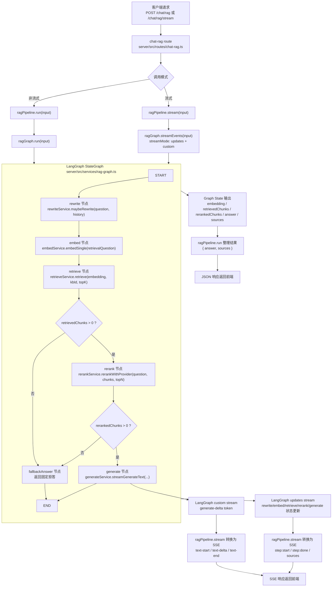
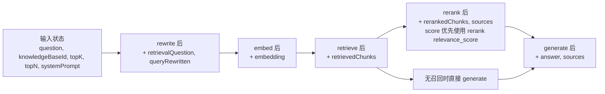

# RAG LangGraph 调用流程

## 目的

本文档描述当前项目中 RAG 调用链的实际实现方式，重点说明：

- 请求从哪里进入
- `ragPipeline`、`ragGraph`、`rag-nodes` 各自承担什么职责
- 非流式和流式两条链路分别如何工作
- 当前 LangGraph 接入点在哪里

本文档基于当前代码实现整理，主要对应以下文件：

- `server/src/routes/chat-rag.ts`
- `server/src/services/rag-pipeline.ts`
- `server/src/services/rag-graph.ts`
- `server/src/services/rag-runables.ts`
- `server/src/services/rag-nodes/*.ts`

## 入口接口

RAG 相关后端入口当前分为两类：

1. `POST /proxy/chat/default`
   桌面聊天 UI 的实际默认入口。当线程 `rag_enabled = 1` 且本次消息可提取出有效用户问题时，路由会切到 `ragPipeline.assistantStream(...)`。
   另外，这一层在进入 graph 前还会先检查默认知识库是否存在可用文档：
   - 若 `enabledDocumentCount = 0`，则不进入 graph，而是直接走固定拒答流式分支
   - 该分支仍会按 assistant stream 协议输出文本，并正常落库与生成标题
2. `POST /chat/rag`
   返回非流式最终结果。
3. `POST /chat/rag/stream`
   返回 SSE 流式结果。
4. `POST /chat/rag/retrieve`
   仅执行检索与重排，不执行生成。

对应路由文件：

- `server/src/routes/proxy-provider.ts`
- `server/src/routes/chat-rag.ts`

## 分层职责

### `rag-nodes`

`server/src/services/rag-nodes/` 是最底层的能力节点，负责单步动作：

- `rewrite.service.ts`
  负责在需要时把用户当前问题改写成更适合知识库检索的查询。
- `embed.service.ts`
  负责 query 向量化。
- `retrieve.service.ts`
  负责向量检索与文档过滤。
- `rerank.service.ts`
  负责结果重排；优先调用当前默认的 rerank 模型，未配置或调用失败时回退到原始检索分排序。
- `generate.service.ts`
  负责基于上下文生成答案，并提供纯文本 token 流。

这一层只关心“单节点能力”，不负责完整流程编排。

## Node Standard IO

当前项目中，每个可观测 RAG 节点都应遵循统一的标准 IO 契约。

相关文件：

- `server/src/services/rag-node-contract.ts`
- `server/src/services/rag-events.ts`
- `server/src/services/rag-node-observation.ts`

### 标准输入

节点输入由 graph 负责组织，通常包括：

- 当前节点执行业务所需的最小输入
- 来自上游节点的状态字段
- 必要的运行时配置

例如：

- `rewrite` 输入：`question`, `conversationHistory`
- `embed` 输入：`retrievalQuestion`
- `retrieve` 输入：`embedding`, `embeddingDimensions`, `embeddingModel`, `knowledgeBaseId`, `topK`
- `rerank` 输入：`question`, `retrievedChunks`, `topN`
- `generate` 输入：`question`, `chunks`, `systemPrompt`, `conversationHistory`

### 标准输出

每个节点服务应提供形如 `runNode(...)` 的方法，并返回：

```ts
type RagNodeResult<TStatePatch> = {
  state: TStatePatch;
  observation: {
    label: string;
    summary?: string;
    details?: Record<string, unknown>;
    sources?: RetrievedChunk[];
    environment?: {
      model?: {
        role?: "task" | "llm" | "embedding" | "rerank" | string;
        providerCode?: string;
        providerLabel?: string;
        protocol?: string;
        operation?: string;
        endpoint?: string;
        model?: string;
        modelConfigId?: string;
        params?: Record<string, unknown>;
        request?: {
          method?: string;
          url?: string;
          body?: Record<string, unknown>;
        };
      };
      result?: {
        success?: boolean;
        finishReason?: string;
        statusCode?: number;
        error?: {
          code?: string;
          type?: string;
          message: string;
        };
        usage?: {
          inputTokens?: number;
          outputTokens?: number;
          totalTokens?: number;
        };
        metrics?: {
          inputCount?: number;
          outputCount?: number;
          returnedCount?: number;
          candidateCount?: number;
        };
        response?: {
          requestId?: string;
          model?: string;
          summary?: Record<string, unknown>;
        };
      };
      retrieval?: {
        knowledgeBaseId?: string | null;
        topK?: number | null;
        topN?: number | null;
        candidateCount?: number | null;
        returnedCount?: number | null;
      };
      timing?: {
        startedAt: string;
        finishedAt: string;
        durationMs: number;
      };
      context?: Record<string, unknown>;
    };
  };
};
```

含义：

- `state`
  该节点写回 graph 状态的增量字段，只表达业务结果
- `observation.label`
  节点的人类可读名称，供前端展示
- `observation.summary`
  节点执行结果摘要
- `observation.details`
  节点结构化调试信息
- `observation.sources`
  节点希望主动广播给前端的引用来源
- `observation.environment`
  节点运行环境信息。该字段是前端观测协议的重要组成部分，不应随意省略或改名

### `environment` 约束

所有节点都应尽量返回 `environment`。

最低要求：

- `timing.startedAt`
- `timing.finishedAt`
- `timing.durationMs`

涉及模型调用的节点必须返回：

- `environment.model.role`
- `environment.model.providerCode` 如果可解析
- `environment.model.providerLabel` 如果可解析
- `environment.model.protocol` 如果可解析
- `environment.model.operation` 如果可解析
- `environment.model.endpoint` 如果可解析
- `environment.model.model` 如果可解析
- `environment.model.modelConfigId` 如果可解析
- `environment.model.params` 如果有明确调用参数
- `environment.model.request.method`
- `environment.model.request.url`
- `environment.model.request.body` 如果可以安全提供请求摘要
- `environment.result.success`
- `environment.result.finishReason`
- `environment.result.metrics`
- `environment.result.response.summary`
- `environment.timing.*`

涉及检索行为的节点应返回：

- `environment.retrieval.knowledgeBaseId` 如果适用
- `environment.retrieval.topK` / `topN` 如果适用
- `environment.retrieval.candidateCount` / `returnedCount` 如果适用

### 广播规则

graph 不再自行拼装节点展示文案，而是消费节点标准输出并统一广播：

- 节点开始时，graph 发 `rag-node(start)`
- 节点完成时，graph 读取 `observation` 发 `rag-node(done)`
- 节点失败时，graph 发 `rag-node(error)`
- 当 `observation.sources` 存在时，graph 发 `rag-sources`

因此：

- 节点业务结果由 `state` 表达
- 节点观测结果由 `observation` 表达
- pipeline 只做协议转发，不承担节点文案拼装责任

### Observation Builder 分层

为了避免节点各自手工拼装相似的观测结构，当前项目提供统一 builder：

- `createObservation(...)`
  最基础的 observation 构造器，适用于非通用类型节点
- `createModelCallObservation(...)`
  适用于涉及模型调用的节点
- `createRetrievalObservation(...)`
  适用于以检索行为为主的节点
- `createModelEnvironment(...)`
  构造 `environment.model`
- `createTimedEnvironment(...)`
  构造带 timing 的 `environment`

使用建议：

- `rewrite`
  可使用 `createObservation(...)`，因为它既不是标准 embedding 调用，也不是标准 retrieval 节点
- `embed`
  使用 `createModelCallObservation(...)`
- `retrieve`
  使用 `createRetrievalObservation(...)`
- `rerank`
  使用 `createModelCallObservation(...)`
- `generate`
  使用 `createModelCallObservation(...)`

原则：

- 优先使用更高层的专用 builder
- 只有在现有 builder 不能表达节点语义时，才退回 `createObservation(...)`
- 不要在节点里重复手工拼装 timing、model environment 或 retrieval environment

### 新增节点约束

后续新增节点时，必须满足：

1. 在对应 `*.service.ts` 中实现 `runNode(...)`
2. `runNode(...)` 返回标准 `RagNodeResult<TStatePatch>`
3. 节点的展示文案、摘要、详情必须定义在节点输出中，而不是写入 pipeline
4. graph 只负责接线、路由、广播，不负责节点业务说明文案
5. 优先复用 `rag-node-observation.ts` 中的 builder，而不是在节点里复制环境拼装逻辑

### 当前节点 IO

#### `rewrite`

输入：

- `question: string`
- `conversationHistory?: NormalizedChatMessage[]`

输出 `state`：

- `retrievalQuestion: string`
- `queryRewritten: boolean`
- `queryRewriteReason: string`

输出 `observation`：

- `label = "准备检索问题"`
- `summary`
- `details.rewritten`
- `details.reason`
- `details.retrievalQuestion`
- `environment.model.role = "task"`
- `environment.timing.*`
- `environment.context.historyMessageCount`
- `environment.context.originalQuestionLength`

#### `embed`

输入：

- `retrievalQuestion: string`

输出 `state`：

- `embedding: number[]`
- `embeddingDimensions: number`
- `embeddingModel: string`
- `embeddingModelConfigId: string`

输出 `observation`：

- `label = "生成查询向量"`
- `summary`
- `details.dimensions`
- `details.model`
- `details.modelConfigId`
- `environment.model.role = "embedding"`
- `environment.model.providerCode`
- `environment.model.model`
- `environment.model.modelConfigId`
- `environment.timing.*`
- `environment.context.inputLength`

#### `retrieve`

输入：

- `embedding: number[]`
- `embeddingDimensions?: number`
- `embeddingModel?: string`
- `embeddingModelConfigId?: string`
- `knowledgeBaseId?: string`
- `topK?: number`

输出 `state`：

- `retrievedChunks: RetrievedChunk[]`

输出 `observation`：

- `label = "检索知识库"`
- `summary`
- `details.count`
- `details.topK`
- `details.knowledgeBaseId`
- `details.sources`
- `environment.retrieval.knowledgeBaseId`
- `environment.retrieval.topK`
- `environment.retrieval.returnedCount`
- `environment.timing.*`
- `environment.context.embeddingDimensions`
- `environment.context.embeddingModel`
- `environment.context.embeddingModelConfigId`

#### `rerank`

输入：

- `question: string`
- `retrievedChunks: RetrievedChunk[]`
- `topN?: number`

输出 `state`：

- `rerankedChunks: RetrievedChunk[]`
- `sources: RetrievedChunk[]`

输出 `observation`：

- `label = "重排候选结果"`
- `summary`
- `details.count`
- `details.topN`
- `details.sources`
- `environment.model.role = "rerank"`
- `environment.model.providerCode`
- `environment.model.model`
- `environment.model.params`
- `environment.retrieval.topN`
- `environment.retrieval.candidateCount`
- `environment.retrieval.returnedCount`
- `environment.timing.*`

#### `generate`

输入：

- `question: string`
- `chunks: RetrievedChunk[]`
- `systemPrompt?: string`
- `conversationHistory?: NormalizedChatMessage[]`

输出 `state`：

- `answer: string`
- `sources: RetrievedChunk[]`

输出 `observation`：

- `label = "组织回答"`
- `summary`
- `details.sourceCount`
- `sources`
- `environment.model.role = "llm"`
- `environment.retrieval.candidateCount`
- `environment.retrieval.returnedCount`
- `environment.timing.*`
- `environment.context.conversationHistoryCount`
- `environment.context.systemPromptProvided`

### `rag-graph`

`server/src/services/rag-graph.ts` 是当前 RAG 流程的编排核心。

它使用 `@langchain/langgraph` 的 `StateGraph` 来定义：

- 图状态
- 节点顺序
- 条件分支
- graph 原生流式输出

当前图中的节点顺序是：

1. `rewrite`
2. `embed`
3. `retrieve`
4. `rerank`、`fallbackAnswer` 或直接 `fallbackAnswer`
5. `generate`

其中有一条条件边：

- 当 `retrievedChunks.length > 0` 时，进入 `rerank`
- 当 `retrievedChunks.length === 0` 时，直接进入 `fallbackAnswer`
- 当 `rerankedChunks.length === 0` 时，进入 `fallbackAnswer`

### `rag-pipeline`

`server/src/services/rag-pipeline.ts` 是对外服务层。

它的职责不是再次定义流程，而是：

- 非流式时调用 `ragGraph.run()`
- 流式时调用 `ragGraph.streamEvents()`
- 将 graph 广播出来的节点事件和生成事件转发为当前前端兼容的 SSE 事件格式

### `rag-runables`

`server/src/services/rag-runables.ts` 现在是对 LangChain Runnable 的薄适配层。

它不再维护一套独立的流程编排，而是直接复用：

- `ragGraph.run()`
- `ragGraph.retrieve()`
- `ragGraph.streamUpdates()`
- `ragGraph.streamValues()`

这保证了“流程定义”只有一份，不会在 pipeline / runnable / graph 三层之间漂移。

## 整体调用流程图



## 状态流转图



## 非流式链路

非流式调用链如下：

1. 路由层接收 `POST /chat/rag`
2. 调用 `ragPipeline.run(input)`
3. `ragPipeline.run()` 调用 `ragGraph.run(input)`
4. `ragGraph.run()` 触发 `StateGraph.invoke(input)`
5. graph 按顺序执行 `rewrite -> embed -> retrieve -> rerank/fallbackAnswer -> generate`
6. graph 最终产出：
   - `answer`
   - `sources`
   - `retrievedChunks`
   - `rerankedChunks`
7. `ragPipeline.run()` 对外只返回：
   - `answer`
   - `sources`

这条链路的特点是：

- 对外接口简单
- 内部状态完整
- 编排逻辑由 LangGraph 统一承担
- 当默认 rerank 模型已配置且启用时，`sources.score` 使用 rerank 返回的 `relevance_score`
- 当 rerank 未配置、未启用或外部调用失败时，流程自动回退到原始向量检索排序
- 当最终可用候选片段数为 `0` 时，后端直接返回固定拒答，不再调用生成模型

## 流式链路

流式调用链如下：

1. 路由层接收 `POST /chat/rag/stream`
2. 调用 `ragPipeline.stream(input)`
3. `ragPipeline.stream()` 调用 `ragGraph.streamEvents(input)`
4. graph 以 `streamMode: ["updates", "custom"]` 输出事件
5. `ragPipeline.stream()` 将 graph 事件转换为当前前端兼容的 SSE 格式

这里有两类 graph 事件：

### `custom`

当前实现把“节点可观测事件”和“生成阶段 token 增量”都放在 custom stream 中广播。

其中节点自己负责发出：

- `type: "rag-node"`
  包含 `nodeId`、`nodeType`、`phase`、`label`、`summary`、`details`
- `type: "rag-sources"`
  用于广播节点产出的引用来源

生成节点另外发出：

- `type: "generate-delta"`

然后 `ragPipeline.stream()` 再把这些 custom 事件转换成前端使用的：

- `data-rag-node`
- `sources`
- `text-start`
- `text-delta`
- `text-end`

这样做的结果是：

- 节点自己的可观测信息由节点自己广播
- pipeline 只负责协议转发，不再拼装节点进度文案
- token 级流式体验仍然保留
- 不需要让前端直接理解 LangGraph 原生事件格式

桌面聊天 UI 走 `POST /proxy/chat/default` 时，内部复用的是同一条 graph 主流程，只是外层使用 `ragPipeline.assistantStream()` 转换成 assistant-ui / AI SDK transport 兼容的事件格式。

## 当前 SSE 事件兼容策略

桌面端当前消费的是结构化 SSE 事件，尤其依赖：

- `text-delta`
- `sources`
- `finish`

对应前端文件：

- `desktop/src/shared/api/chat.ts`

因此当前设计没有直接把 `/chat/rag/stream` 暴露为 LangGraph 原生 stream，而是增加了一个转换层：

- graph 负责真实执行与状态产出
- `ragPipeline.stream()` 负责协议兼容

这是当前阶段一个有意保留的边界。

## 当前设计的优点

- 流程编排只有一份，避免多份实现漂移
- 非流式和流式都复用同一条 LangGraph 主流程
- 可以自然扩展 checkpoint、interrupt、fallback、LangSmith trace
- 保留现有前端 SSE 协议，不要求 UI 立刻跟着重写

## 当前设计的边界

目前仍有一层“graph 事件 -> SSE 协议”的转换逻辑存在于 `rag-pipeline.ts`。

这意味着：

- graph 已经是主编排层
- 但 HTTP 流协议还不是 LangGraph 原生协议

这是当前为了兼容现有前端做的折中，而不是最终极形态。

## 运行时日志

当前可以通过 `server/logs/server.log` 观察 RAG 与 rerank 是否真的执行：

- `scope: "proxy-provider", event: "rag-branch-enter"`
  表示 `POST /proxy/chat/default` 已命中 RAG 分支。
- `scope: "rag-graph", event: "retrieve-complete"`
  表示检索完成，可查看 `retrievedCount`、`topK`、`topN`。
- `scope: "rag-graph", event: "rerank-enter"` / `event: "rerank-exit"`
  表示 graph 已进入 rerank 节点并返回结果。
- `scope: "rag-rerank"`
  表示 rerank 服务层的实际行为，常见事件包括：
  - `start`
  - `success`
  - `skipped`
  - `fallback`

如果只看到 `retrieve-complete` 且 `retrievedCount = 0`，说明这次检索没有召回 chunk，所以 graph 会按设计直接跳过 rerank。

如果看到 `rerank-exit` 但 `rerankedCount = 0`，说明重排后没有保留任何候选片段，graph 会直接返回固定拒答，不再调用生成模型。

## 后续建议

如果后续继续往 LangGraph 生态靠拢，建议优先考虑以下几个方向：

1. 为 `ragGraph` 增加 checkpoint
   用于恢复执行、消息编辑和人工中断。
2. 增加更明确的 fallback 分支
   例如“无召回时拒答”与“无召回时普通聊天”两种可配置路径。
3. 评估前端是否逐步接 LangGraph 原生 runtime
   这样可以减少服务端 SSE 转换层。
4. 为 graph 增加 tracing / metrics
   便于观察每个节点的耗时、命中数和失败点。
