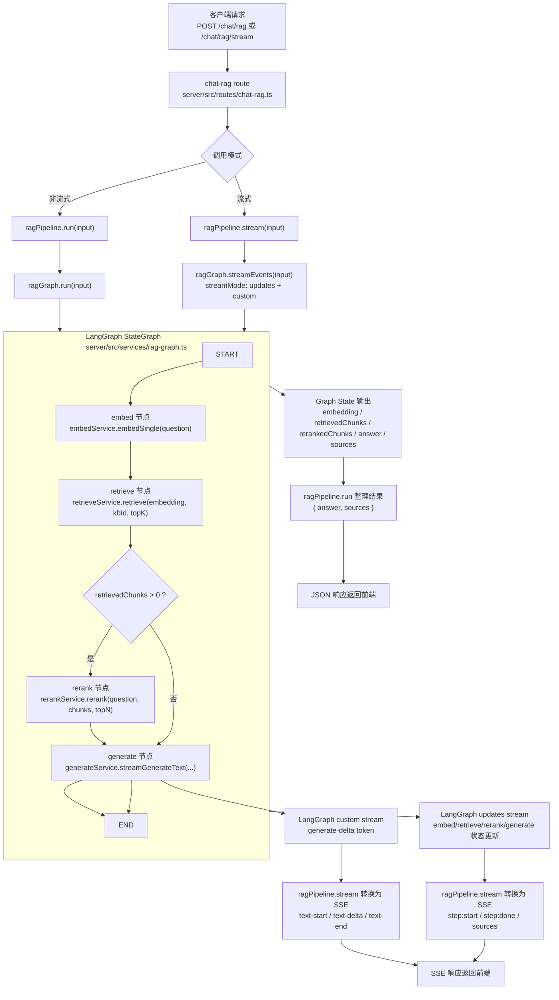
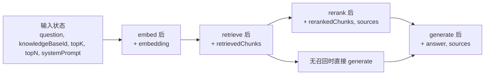

# RAG LangGraph 调用流程

## 目的

本文档描述当前项目中 RAG 调用链的实际实现方式，重点说明：

- 请求从哪里进入
- `ragPipeline`、`ragGraph`、`rag-nodes` 各自承担什么职责
- 非流式和流式两条链路分别如何工作
- 当前 LangGraph 接入点在哪里

本文档基于当前代码实现整理，主要对应以下文件：

- `server/src/routes/chat-rag.ts`
- `server/src/services/rag-pipeline.ts`
- `server/src/services/rag-graph.ts`
- `server/src/services/rag-runables.ts`
- `server/src/services/rag-nodes/*.ts`

## 入口接口

RAG 相关后端接口当前有三条：

1. `POST /chat/rag`
   返回非流式最终结果。
2. `POST /chat/rag/stream`
   返回 SSE 流式结果。
3. `POST /chat/rag/retrieve`
   仅执行检索与重排，不执行生成。

对应路由文件：

- `server/src/routes/chat-rag.ts`

## 分层职责

### `rag-nodes`

`server/src/services/rag-nodes/` 是最底层的能力节点，负责单步动作：

- `embed.service.ts`
  负责 query 向量化。
- `retrieve.service.ts`
  负责向量检索与文档过滤。
- `rerank.service.ts`
  负责结果重排。
- `generate.service.ts`
  负责基于上下文生成答案，并提供纯文本 token 流。

这一层只关心“单节点能力”，不负责完整流程编排。

### `rag-graph`

`server/src/services/rag-graph.ts` 是当前 RAG 流程的编排核心。

它使用 `@langchain/langgraph` 的 `StateGraph` 来定义：

- 图状态
- 节点顺序
- 条件分支
- graph 原生流式输出

当前图中的节点顺序是：

1. `embed`
2. `retrieve`
3. `rerank` 或直接 `generate`
4. `generate`

其中有一条条件边：

- 当 `retrievedChunks.length > 0` 时，进入 `rerank`
- 当 `retrievedChunks.length === 0` 时，跳过 `rerank`，直接进入 `generate`

### `rag-pipeline`

`server/src/services/rag-pipeline.ts` 是对外服务层。

它的职责不是再次定义流程，而是：

- 非流式时调用 `ragGraph.run()`
- 流式时调用 `ragGraph.streamEvents()`
- 将 graph 原生事件转换为当前前端兼容的 SSE 事件格式

### `rag-runables`

`server/src/services/rag-runables.ts` 现在是对 LangChain Runnable 的薄适配层。

它不再维护一套独立的流程编排，而是直接复用：

- `ragGraph.run()`
- `ragGraph.retrieve()`
- `ragGraph.streamUpdates()`
- `ragGraph.streamValues()`

这保证了“流程定义”只有一份，不会在 pipeline / runnable / graph 三层之间漂移。

## 整体调用流程图

## 状态流转图

## 非流式链路

非流式调用链如下：

1. 路由层接收 `POST /chat/rag`
2. 调用 `ragPipeline.run(input)`
3. `ragPipeline.run()` 调用 `ragGraph.run(input)`
4. `ragGraph.run()` 触发 `StateGraph.invoke(input)`
5. graph 按顺序执行 `embed -> retrieve -> rerank/generate`
6. graph 最终产出：
   - `answer`
   - `sources`
   - `retrievedChunks`
   - `rerankedChunks`
7. `ragPipeline.run()` 对外只返回：
   - `answer`
   - `sources`

这条链路的特点是：

- 对外接口简单
- 内部状态完整
- 编排逻辑由 LangGraph 统一承担

## 流式链路

流式调用链如下：

1. 路由层接收 `POST /chat/rag/stream`
2. 调用 `ragPipeline.stream(input)`
3. `ragPipeline.stream()` 调用 `ragGraph.streamEvents(input)`
4. graph 以 `streamMode: ["updates", "custom"]` 输出事件
5. `ragPipeline.stream()` 将 graph 事件转换为当前前端兼容的 SSE 格式

这里有两类 graph 事件：

### `updates`

用于表示步骤状态更新，例如：

- `embed` 完成
- `retrieve` 完成
- `rerank` 完成
- `generate` 最终状态写入

这一类事件被转换成前端可识别的：

- `step`
- `sources`

### `custom`

用于表示生成阶段的 token 增量。

当前 `generate` 节点内部通过 LangGraph `writer` 发出：

- `type: "generate-delta"`

然后 `ragPipeline.stream()` 再把它转换成当前前端使用的：

- `text-start`
- `text-delta`
- `text-end`

这样做的结果是：

- 步骤编排和状态流由 graph 统一提供
- token 级流式体验仍然保留
- 不需要让前端直接理解 LangGraph 原生事件格式

## 当前 SSE 事件兼容策略

桌面端当前消费的是结构化 SSE 事件，尤其依赖：

- `text-delta`
- `sources`
- `finish`

对应前端文件：

- `desktop/src/shared/api/chat.ts`

因此当前设计没有直接把 `/chat/rag/stream` 暴露为 LangGraph 原生 stream，而是增加了一个转换层：

- graph 负责真实执行与状态产出
- `ragPipeline.stream()` 负责协议兼容

这是当前阶段一个有意保留的边界。

## 当前设计的优点

- 流程编排只有一份，避免多份实现漂移
- 非流式和流式都复用同一条 LangGraph 主流程
- 可以自然扩展 checkpoint、interrupt、fallback、LangSmith trace
- 保留现有前端 SSE 协议，不要求 UI 立刻跟着重写

## 当前设计的边界

目前仍有一层“graph 事件 -> SSE 协议”的转换逻辑存在于 `rag-pipeline.ts`。

这意味着：

- graph 已经是主编排层
- 但 HTTP 流协议还不是 LangGraph 原生协议

这是当前为了兼容现有前端做的折中，而不是最终极形态。

## 后续建议

如果后续继续往 LangGraph 生态靠拢，建议优先考虑以下几个方向：

1. 为 `ragGraph` 增加 checkpoint
   用于恢复执行、消息编辑和人工中断。
2. 增加更明确的 fallback 分支
   例如“无召回时拒答”与“无召回时普通聊天”两种可配置路径。
3. 评估前端是否逐步接 LangGraph 原生 runtime
   这样可以减少服务端 SSE 转换层。
4. 为 graph 增加 tracing / metrics
   便于观察每个节点的耗时、命中数和失败点。
